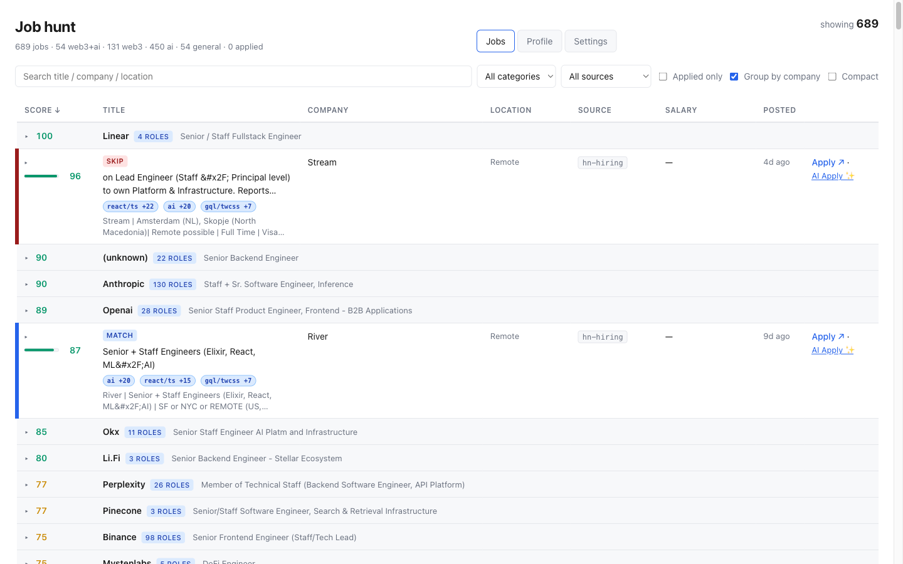
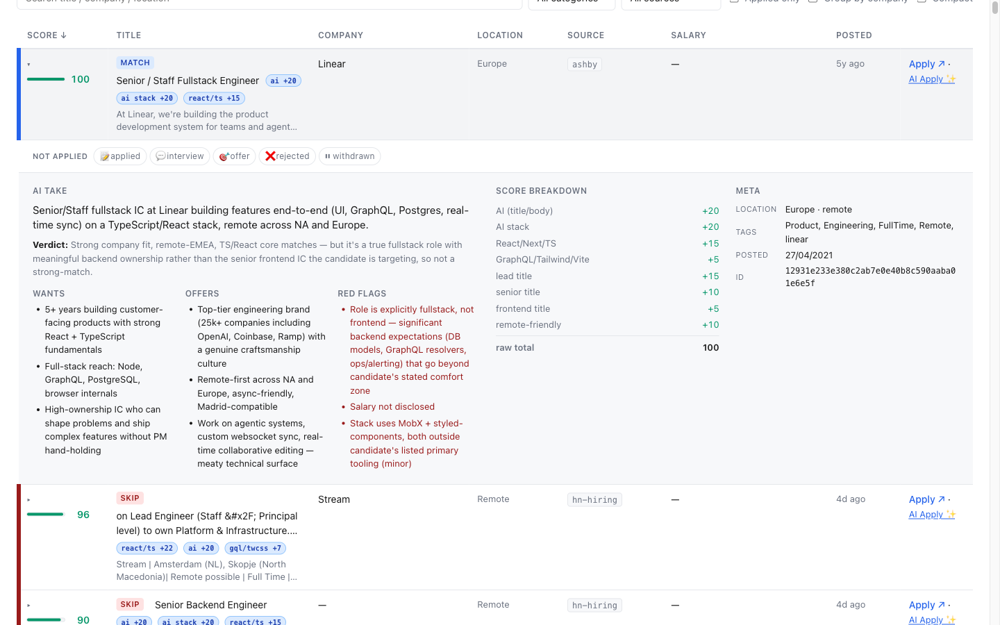
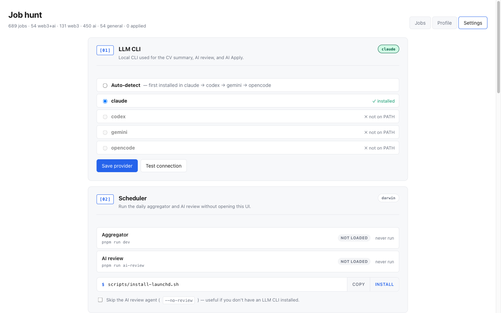

# job-hunt

<p align="center">
  <a href="https://github.com/FranRom/job-hunt/actions/workflows/check.yml"></a>
  <a href="./LICENSE"></a>
  
  
  
</p>

<p align="center">
  
</p>

A **config-driven, local-first, forkable** daily job aggregator powered by local LLM CLIs. Pulls listings from 13 public sources (3 ATSes — Greenhouse, Ashby, Lever — plus RSS feeds, JSON job boards, Hacker News, HTML scrapers, an Aave Next.js scraper, and an Ashby-private GraphQL fetcher), scores each one against **your** profile, deduplicates, and writes the result to your local checkout. No hosted services. No API keys. No DB.

The AI features (per-job review, AI Apply package generation, profile generation from a CV) shell out to whichever LLM CLI you have installed — `claude`, `codex`, `gemini`, or `opencode`. There are no project tokens; every AI call runs on your existing CLI subscription. See [`docs/ai-pipeline.md`](./docs/ai-pipeline.md) for the integration architecture.

> **Already set up?** → [`JOBS.md`](./JOBS.md) (auto-generated daily) · [`data/jobs.json`](./data/jobs.json) · [`data/feed.xml`](./data/feed.xml) (RSS, `file://` path) · `pnpm run ui` for the local dashboard.

## Documentation

- **Forking & personalizing** — this README, sections below.
- **Pipeline architecture, filter scoring, dedup, salary parsing** — [`docs/architecture.md`](./docs/architecture.md).
- **AI pipeline (LLM CLI abstraction, AI review, AI Apply)** — [`docs/ai-pipeline.md`](./docs/ai-pipeline.md).
- **Contributor workflow + project invariants** — [`CONTRIBUTING.md`](./CONTRIBUTING.md).
- **Agent (Claude Code / Codex / Cursor) operational guidance** — [`AGENTS.md`](./AGENTS.md).

## Why

Manually checking a dozen job boards every morning is tedious. This repo replaces it with a single auto-generated table, scored by relevance, sorted by fit, with a "✨ New since last run" section at the top so the daily diff is the actionable bit. The AI second-opinion verdict on the top slice helps you skip postings that look right on paper but aren't. Everything runs locally — a launchd / cron agent triggers the daily run, output lives in your working tree.

## Screenshots

<p align="center">
  
  <em>Local dashboard. 689 jobs scored, deduped, and grouped by company. Verdict badges flag the AI's call (`MATCH` / `SKIP`) at a glance; the score-tiered indicator shows green ≥80, gold 50–79, muted &lt;50.</em>
</p>

<p align="center">
  
  <em>Expanded row: the AI review (summary, wants, offers, red flags) sits next to the rule-based <code>_signals</code> breakdown so you can see exactly which scoring rules fired and where the LLM agrees or pushes back.</em>
</p>

<p align="center">
  
  <em>Settings tab: the LLM CLI panel auto-detects which providers are on PATH and lets you switch with one click. The scheduler panel installs and uninstalls the launchd / cron agents in-app — no manual editing of plists or crontabs.</em>
</p>

## Stack

| Layer | Choice |
|---|---|
| Runtime | Node 22 LTS, ESM modules |
| Language | TypeScript 5.9 (NodeNext, strict) |
| Lint + format | Biome 2.4 |
| Package manager | pnpm 10 |
| Tests | Vitest 3 |
| Pre-commit | simple-git-hooks (lint + typecheck) |
| HTTP | Native `fetch` + `AbortController` (30s timeout, 1 retry on 5xx/network) |
| RSS parsing | `fast-xml-parser` (only runtime dep) |
| Schedule | Local launchd (macOS) / cron (Linux), two agents: aggregator + AI review |
| AI integration | Local LLM CLI (`claude` / `codex` / `gemini` / `opencode`) — no SDKs, no API keys |
| Output | Files in your local checkout |
| CI | Biome + tsc + Vitest + build + `pnpm audit` on every PR; Dependabot for npm + GitHub Actions |

## Architecture

```
                ┌─────────────────────────────────────────────────┐
                │ launchd / cron — local agent, daily              │
                └─────────────────────────────────────────────────┘
                                      │
                                      ▼
        ┌─────────────────── src/index.ts ──────────────────┐
        │                                                   │
        │   Fetchers (Promise.all, 13 sources)              │
        │             │                                     │
        │             ▼                                     │
        │   normalize (per source) → Job[]                  │
        │             │                                     │
        │             ▼                                     │
        │   filters.applyFilters: hard excludes + scoring   │
        │             │                                     │
        │             ▼                                     │
        │   dedup.dedupe: by URL, then by company+title     │
        │             │                                     │
        │             ▼                                     │
        │   sort by fitScore → salaryMax → postedAt → id    │
        │             │                                     │
        │             ▼                                     │
        │   attach applied status, diff vs previous run     │
        │             │                                     │
        │             ▼                                     │
        │   write data/jobs.json + data/feed.xml + JOBS.md  │
        │             │                                     │
        │             ▼  (optional, second agent)           │
        │   ai-review.ts → per-job LLM verdict              │
        │     via local CLI → data/ai-reviews.json          │
        │                                                   │
        └───────────────────────────────────────────────────┘
```

Each fetcher is isolated: it catches its own errors, returns an empty `items` array on failure, and a 30-second timeout caps every HTTP call. One source going down can't break the rest of the run. Deep dive: [`docs/architecture.md`](./docs/architecture.md).

## Sources

The three ATS fetchers carry the bulk of the high-quality signal; the rest backfill long-tail listings.

| Source | Type | Endpoint |
|---|---|---|
| [ashby](./src/fetchers/ashby.ts) | JSON API | `api.ashbyhq.com/posting-api/job-board/<slug>` × tier-S slugs |
| [greenhouse](./src/fetchers/greenhouse.ts) | JSON API | `boards-api.greenhouse.io/v1/boards/<slug>/jobs` × tier-S slugs |
| [lever](./src/fetchers/lever.ts) | JSON API | `api.lever.co/v0/postings/<slug>` × tier-S slugs |
| [ashby-private](./src/fetchers/ashby-private.ts) | GraphQL × N slugs | `jobs.ashbyhq.com/api/non-user-graphql` (Ashby orgs with public API disabled) |
| [aave](./src/fetchers/aave.ts) | HTML scraper (Next.js `__NEXT_DATA__`) | `aave.com/careers` |
| [remoteok](./src/fetchers/remoteok.ts) | JSON API | `remoteok.com/api` |
| [remotive](./src/fetchers/remotive.ts) | JSON API | `remotive.com/api/remote-jobs?category=software-dev` |
| [weworkremotely](./src/fetchers/weworkremotely.ts) | RSS 2.0 | `weworkremotely.com/categories/remote-programming-jobs.rss` |
| [cryptojobslist](./src/fetchers/cryptojobslist.ts) | RSS 2.0 | `api.cryptojobslist.com/jobs.rss` |
| [web3career](./src/fetchers/web3career.ts) | HTML scraper | `web3.career` (5 category pages) |
| [aijobsnet](./src/fetchers/aijobsnet.ts) | HTML scraper | `aijobs.net` (global + EU) |
| [hn-hiring](./src/fetchers/hn-hiring.ts) | Algolia API | latest "Ask HN: Who is hiring" thread |
| [hn-jobs](./src/fetchers/hn-jobs.ts) | Algolia API | `hn.algolia.com/api/v1/search_by_date?tags=job` |

Adding a source is one new file in `src/fetchers/`, one entry in `Source`, one normalizer, and one line in `src/index.ts`. Recipe in [`CONTRIBUTING.md`](./CONTRIBUTING.md#adding-a-source).

## Forking & personalizing

The repo ships neutral defaults. To make it yours:

### 1. Clone

```bash
gh repo fork ogarciarevett/job-hunt --clone
cd job-hunt
pnpm install
```

### 2. Generate your candidate brief (required)

The brief at `config/candidate-brief.md` is the natural-language description of who you are, what you want, and what to avoid. **This step is mandatory** — `pnpm run dev` will refuse to start until the file exists. Bypass with `JOB_HUNT_NO_BRIEF_CHECK=1` for raw aggregation only.

**The file is gitignored** — it contains CV-derived personal information.

The friendliest path is the **first-run onboarding wizard**: run `pnpm run ui` on a clean repo and the UI walks you through (1) picking your LLM CLI, (2) dropping your CV, (3) confirming the auto-generated brief. After "Looks good", `config/preferences.json` is stamped with `onboardedAt` and the wizard never re-triggers.

For the CLI-only path:

```bash
pnpm run setup-brief --file ~/cv.pdf       # PDF
pnpm run setup-brief --file ~/cv.docx      # Word
pnpm run setup-brief --file ~/cv.md        # Markdown
cat resume.txt | pnpm run setup-brief      # stdin
```

The auto-detected provider order is `claude → codex → gemini → opencode` (whichever is on `PATH` first). Override with `JOB_HUNT_LLM=codex pnpm run setup-brief ...`.

> The two personalization layers:
> - `config/profile.json` (committed defaults) controls **what gets fetched + scored** (weights, keyword lists, tier-S slugs).
> - `config/candidate-brief.md` (gitignored, CV-derived) controls **the per-job AI verdict** (`pnpm run ai-review`).

### 3. Scoring profile (auto-generated, hand-tunable)

[`config/profile.json`](./config/profile.json) drives what gets scored. After onboarding, `/api/profile-generate` runs your local LLM CLI on the brief and fills in weights, keyword lists, and the `titleExcludedSpecialties` regex (a frontend brief gets `(backend|data|devops|sre|...) engineers?` so those titles hard-drop). Re-run any time from **Settings → Scoring profile → Regenerate**, or hand-tune `config/profile.json` directly — your edits won't be overwritten unless you regenerate.

Filter scoring detail (signals, tiered weighting, `_signals` debug breakdown) lives in [`docs/architecture.md`](./docs/architecture.md#3-filter--score).

### 4. Update the company slug list

Edit [`config/slugs.json`](./config/slugs.json) to add Ashby / Greenhouse / Lever slugs you want to follow. Slugs come from the URL of the careers page (`jobs.ashbyhq.com/<slug>`, etc.). 404s are silently skipped, so trial-and-error is safe. Probe commands in [`AGENTS.md`](./AGENTS.md#how-to-add-a-tier-s-company).

### 5. Schedule the daily run

Two agents run on independent schedules so you can tune them separately:

- **Aggregator** (`pnpm run dev`) — fetches sources, scores, writes `data/jobs.json` + `JOBS.md` + `data/feed.xml`. No LLM needed.
- **AI per-job review** (`pnpm run ai-review`) — sends each top-scoring job through your local LLM CLI. Skipped via `--no-review` if you don't have a CLI installed.

**macOS (launchd, recommended):**

```bash
./scripts/install-launchd.sh                              # both, defaults: aggregate 07:00, review 07:15
./scripts/install-launchd.sh --aggregate-time 06:30
./scripts/install-launchd.sh --no-review                  # aggregator only
./scripts/install-launchd.sh --uninstall                  # remove both
launchctl list | grep job-hunt                            # check status
launchctl start dev.${USER}.job-hunt.aggregate            # trigger now
```

launchd's `StartCalendarInterval` catches up missed runs after wake.

**Linux (cron):**

```bash
./scripts/install-cron.sh                                 # both, defaults
./scripts/install-cron.sh --no-review
./scripts/install-cron.sh --uninstall
```

**Manual:**

```bash
pnpm run daily                                            # = pnpm run dev && pnpm run ai-review
```

Logs land in `data/launchd-{aggregate,review}.{out,err}.log` (macOS) or `data/cron-{aggregate,review}.log` (Linux). Nothing is pushed anywhere.

### 6. Personal data + privacy

These files are **gitignored** and never committed, so a public fork can't leak them:

| File | What it is | Source |
|---|---|---|
| `config/candidate-brief.md` | LLM-generated CV summary | Onboarding wizard / `setup-brief` |
| `config/cv.{pdf,docx,md,txt}` | Original CV file | Saved by onboarding so AI Apply can re-attach |
| `config/applied.json` | Application history | UI status pills |
| `config/preferences.json` | LLM CLI + onboarding-complete stamp | Onboarding wizard |
| `data/jobs.json`, `data/feed.xml`, `JOBS.md` | Daily aggregator output | Auto-created by `pnpm run dev` |
| `data/ai-reviews.json` | Per-job LLM verdicts | Auto-created by `pnpm run ai-review` |
| `data/applications/<job-id>.md` | AI-generated application packages | Auto-created by AI Apply |
| `data/archive/*.json`, `data/raw/*` | Monthly snapshots + raw per-source debug dumps | Auto-created by `pnpm run dev` |

If you want git history of any of these (e.g. a private fork as a sync mechanism), remove the line from `.gitignore` and `git add` manually.

#### Reset to a clean slate

```bash
pnpm run clean              # wipe generated outputs, archives, raw caches, logs
pnpm run clean -- --all     # also wipe candidate-brief.md + applied.json (full reset)
```

Idempotent — running on an already-clean state prints `nothing to clean`.

## Run locally

```bash
pnpm install                          # one-time; also installs the pre-commit hook
pnpm run dev                          # tsx, no build step
pnpm run typecheck                    # tsc --noEmit across 3 tsconfigs
pnpm run lint                         # biome check
pnpm test                             # vitest run
pnpm run ui                           # local UI on 127.0.0.1:5173
pnpm run ai-review                    # LLM CLI per-job review
pnpm run setup-brief --file ~/cv.pdf  # CV → candidate-brief.md
pnpm run daily                        # = dev && ai-review
pnpm run clean                        # wipe locally-generated artifacts
```

A pipeline run takes ~5–10 seconds and produces:

- `data/jobs.json` — slim sorted list (no `body` field)
- `data/feed.xml` — RSS 2.0 of "✨ new" jobs (top 50)
- `JOBS.md` — readable matches table: source-health banner, stats, applied, ✨ new, 🗑 removed, category tables
- `data/archive/<YYYY-MM>.json` — monthly snapshot (day 1)
- `data/raw/<source>-<YYYY-MM-DD>.json` — per-source debug payloads (gitignored)

The pre-commit hook runs `lint && typecheck` on every commit. Bypass with `SKIP_SIMPLE_GIT_HOOKS=1` for emergencies.

## Customization quick reference

- **Adjust filter weights or keywords** — edit `config/profile.json`. JSON is loaded at startup; arrays compile to word-bounded case-insensitive regexes. No code change needed.
- **Add a tier-S company** — append a slug to `config/slugs.json`. Recipe in [`AGENTS.md`](./AGENTS.md#how-to-add-a-tier-s-company).
- **Add a new source** — recipe in [`CONTRIBUTING.md`](./CONTRIBUTING.md#adding-a-source).
- **Deeper filter / signal tuning** — see [`docs/architecture.md`](./docs/architecture.md).

## Security

Defense-in-depth measures, ranked from runtime to build-time:

- **URL scheme allowlist.** [`isSafeUrl`](./src/utils.ts) rejects anything not `http(s):`. Defends against `javascript:` / `data:` / `file:` payloads from upstream.
- **HTML attribute escaping.** Apply links in `JOBS.md` use `escapeHtmlAttr` and `rel="noopener noreferrer"` (blocks tabnabbing).
- **HTML stripping.** All scraped bodies run through `stripHtml` before any processing.
- **Pre-commit hook** runs `lint && typecheck`. Bypass with `SKIP_SIMPLE_GIT_HOOKS=1`.
- **`pnpm audit --prod --audit-level high`** in `check.yml`.
- **Pinned actions.** Third-party actions referenced by full commit SHA, not floating tags.
- **Minimum permissions.** `check.yml` uses `contents: read` only.

## License

Licensed under the [BSD 3-Clause License](./LICENSE) — use, fork, modify, and redistribute freely, including for commercial purposes, **with attribution**. Redistributions must retain the copyright notice + license text, and the names of the copyright holder and contributors may not be used to endorse or promote derived products without prior written permission.
