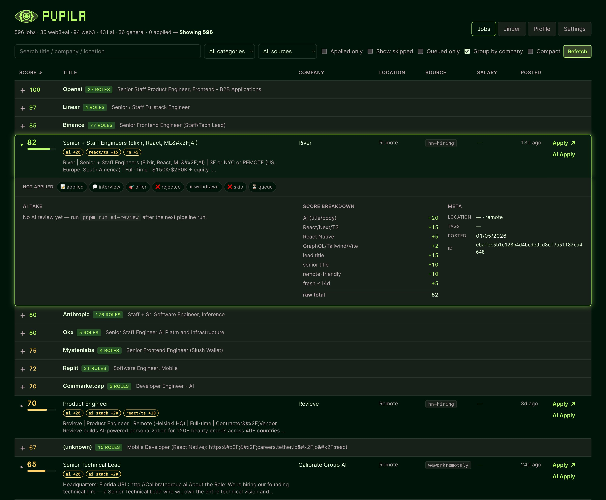
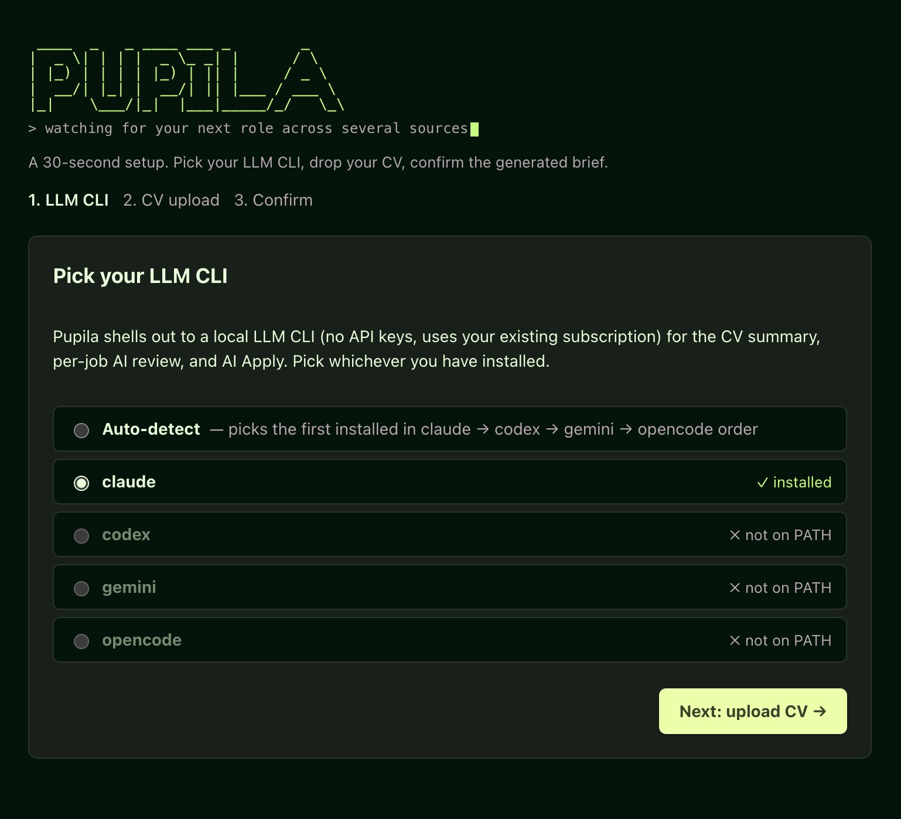
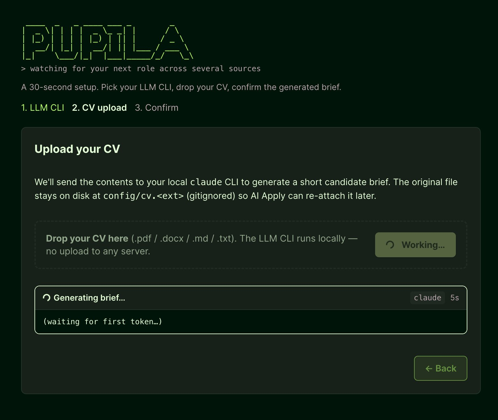
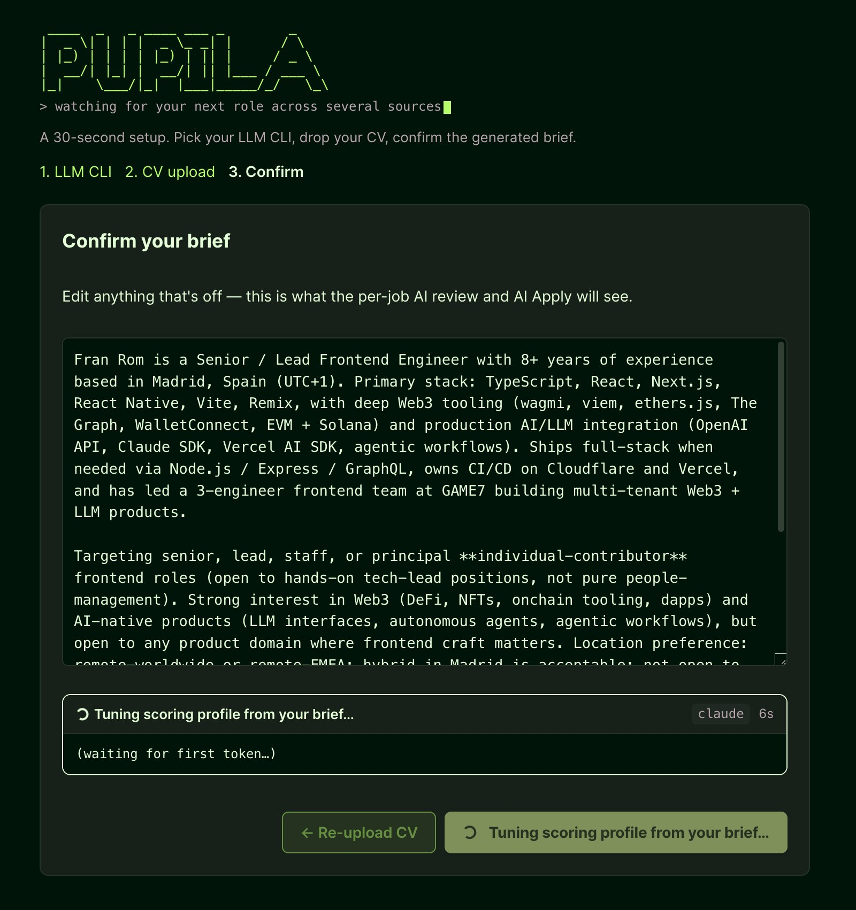

<p align="left">
  </p>

# PUPILA: An A-Eye on every job board

<p align="center">
  
</p>

## What

PUPILA is a local-first job aggregator. Choose for schedule a task or trigger a manual refetch and it pulls from many public sources (adding more is an easy job), filters out the noise (junior roles, non-engineering, onsite-only, etc.), and scores each remaining posting against your CV-derived profile. You wake up to a single sorted table of roles that actually fit, every row links to the original posting, so you can apply directly. **That's the core value: getting the data, filtering it, and scoring it. The AI layers below are optional.**

Optional layers, powered by your local LLM CLI (`claude` / `codex` / `gemini` / `opencode` — no API keys, no cloud, no third party ever sees your data):

- **AI per-job review** — a `strong-match` / `match` / `weak-match` / `skip` verdict with a one-line reason next to each title.
- **Jinder** — a Tinder-style swipe deck for triaging the top matches in seconds: right-swipe to queue a role for application, left-swipe to skip it forever.
- **AI Apply** — drafts a tailored cover letter + highlights + Q&A package from your CV and the posting for every job in the queue, while you do something else.
- **MCP server** — exposes everything the UI can do (17 tools: query / detail / mark applied / enqueue / queue status / aggregator runs / profile regen) to any MCP client so you can drive Pupila from inside Claude Code, Claude Desktop, or Cursor. One-command install. [Jump to section ↓](#mcp-server--talk-to-your-data-from-an-ai-client)

<p align="left">
  
</p>

## Key features

The stuff that makes the daily routine actually pleasant:

- **Day-over-day diff.** Every run computes what's *new* and what *disappeared* since yesterday — surfaced as **✨ New since last run** + **🗑 Removed since last run** at the top of `JOBS.md`. The actionable bit is always the first thing you see.
- **Scheduled, no babysitting.** `scripts/install-launchd.sh` (macOS) and `scripts/install-cron.sh` (Linux) install two agents — aggregator + AI review — that run on independent times. launchd catches up missed runs after wake.
- **Group-by-company (default on).** Folds a 24-role Vercel into one expandable row instead of dominating the top of your table.
- **URL-encoded view state.** Every filter, sort, and expanded row syncs to `?q=...&cat=...&src=...` — bookmark a filtered view and it rehydrates next time.
- **Source-health banner.** A 🚨 banner appears in `JOBS.md` when a fetcher returns zero items or errors, so silent upstream breakage isn't silent.
- **Application tracking.** Click a status pill on any row (`📝 applied / 💬 interview / 🎯 offer / ❌ rejected / ⏸ withdrawn`) — saves to `config/applied.json` and feeds the "📋 Application status" section at the top of `JOBS.md`.
- **8-panel Settings dashboard** — switch LLM CLI / install or remove the scheduler / regenerate scoring profile / inspect the last run / check disk usage / clean / view environment / monitor the apply queue, all from `pnpm run ui` → Settings.
- **Talk to your data from an AI client.** Optional MCP server exposes every actionable UI surface (filter jobs, mark applied, enqueue AI Apply, trigger a refresh, regenerate the scoring profile) to Claude Code / Claude Desktop / Cursor via 17 typed tools. One command (`bash scripts/install-mcp.sh`) wires it in.
- **RSS feed.** `data/feed.xml` gets every "✨ new" job — point any RSS reader at the local `file://` path.
- **Local-first by design.** No API keys, no cloud, no hosted scheduler. The LLM features use *your* existing `claude` / `codex` / `gemini` / `opencode` subscription via the CLI. Your CV, brief, and applied list never leave the machine.

## Onboarding

The first time you run `pnpm run ui`, a three-step wizard sets you up. Total time: about 30 seconds.

### 1. Pick your LLM CLI

<p align="left">
  
</p>

PUPILA shells out to whichever AI CLI you already have authenticated locally — `claude`, `codex`, `gemini`, or `opencode`. The wizard auto-detects what's on your `PATH` and pre-selects the first available one. No API keys, no signup, no per-token billing — it uses your existing CLI subscription.

### 2. Drop your CV

<p align="left">
  
</p>

Drag a `.pdf` / `.docx` / `.md` / `.txt` CV onto the drop zone (or click **Choose file**). The CV is parsed locally and sent to your LLM CLI to generate a short candidate brief — who you are, what stack you work in, what kind of role you want, and what to avoid. The original CV stays on disk at `config/cv.<ext>` (gitignored) so **AI Apply** can re-attach it later.

**No recent CV?** Click **Import from LinkedIn instead** (optional) and upload a LinkedIn profile PDF — on your LinkedIn profile, go to **More → Save to PDF**, then drop the downloaded file here. It runs through the same parse → LLM pipeline with a LinkedIn-tuned prompt, so the resulting brief is comparable to a CV-sourced one. (No login or scraping — the "Save to PDF" export is fully self-serve.)

### 3. Confirm the generated brief

<p align="left">
  
</p>

Eyeball the brief and edit anything that needs tweaking — this natural-language description drives every scoring decision and AI verdict downstream. Hit **Looks good** and the wizard stamps `config/preferences.json` with `onboardedAt`, never re-triggers, and kicks off the first aggregator run automatically. You land on the Jobs view already populated.

## How it works

A config-driven, **local-first** daily job aggregator. Pulls listings from a dozen-plus public sources (job boards, RSS feeds, Hacker News, three ATSes — Greenhouse, Ashby, Lever — plus a custom Aave scraper and an Ashby-private GraphQL fetcher; adding a new source is one file), normalizes them into a single shape, scores each one against **your** profile (defined in [`config/profile.json`](./config/profile.json)), deduplicates, and writes the result to your local checkout.

Designed to be **cloned and run locally**. No hosted scheduler, no public dashboard, no external services. Anyone — frontend, backend, mobile, data, infra, any seniority, any region — sets their role via:

1. A short candidate brief generated from their CV (run `pnpm run setup-brief --file ~/cv.pdf`, or use the local UI's Profile tab).
2. Tunable scoring weights and keyword lists in `config/profile.json`.
3. Tier-S company slugs in `config/slugs.json`.

Then schedule the aggregator with `scripts/install-launchd.sh` (macOS) or `scripts/install-cron.sh` (Linux). Two agents are installed by default: one for the aggregator, one for the AI per-job review.

After onboarding, `config/profile.json` is auto-generated from your candidate brief by `/api/profile-generate` (scoring weights + keyword lists tuned to the stack you actually work in, and an exclusion list pulled from your brief's "what to avoid" section). Re-runnable from the Settings tab → Scoring profile → Regenerate.

Contributing rules and project invariants live in [`CONTRIBUTING.md`](./CONTRIBUTING.md).

> **Looking for today's matches?** → [`JOBS.md`](./JOBS.md) (auto-generated by the local aggregator).
> Raw data lives in [`data/jobs.json`](./data/jobs.json).
> Local RSS feed at [`data/feed.xml`](./data/feed.xml) (point your reader at the file:// path).
> Prefer a UI? → `pnpm run ui` opens a local-only Vite dashboard at `http://127.0.0.1:5173`. Four tabs: **Jobs** (filter, search, sortable columns, click-to-expand rows over `data/jobs.json`), **Jinder** (Tinder-style swipe deck — right-swipe to queue an AI Apply, left-swipe to skip), **Profile** (drop a PDF/DOCX/MD CV — or import a LinkedIn profile PDF — to set up or refresh your candidate brief), and **Settings** (scheduler lifecycle, scoring profile regenerate, disk usage, apply queue). See [AI Apply](#ai-apply-per-job-optional) and [AI per-job review](#ai-per-job-review) below.

---

## Forking & personalizing

The repo ships with neutral defaults. To make it yours:

### 1. Clone or fork

```bash
gh repo fork FranRom/pupila --clone
cd pupila
pnpm install
```

Or click "Fork" on GitHub, then `git clone <your-fork>`.

### 2. Generate your candidate brief (required)

The brief at `config/candidate-brief.md` is the natural-language description of who you are, what you want, and what to avoid. **This step is mandatory** — `pnpm run dev` will refuse to start until the file exists. (Bypass with `PUPILA_NO_BRIEF_CHECK=1` if you genuinely want raw aggregation with no AI review.)

**The file is gitignored** — it contains CV-derived personal information and should never be committed. setup-brief and the onboarding wizard write to the gitignored canonical path.

The friendliest path is the **first-run onboarding wizard**: run `pnpm run ui` on a clean repo and the UI walks you through (1) picking your LLM CLI, (2) dropping your CV, (3) confirming the auto-generated brief. After "Looks good", `config/preferences.json` is stamped with `onboardedAt`, the wizard never re-triggers, and you land on the Jobs view.

For the CLI-only path, run setup-brief directly:

```bash
pnpm run setup-brief --file ~/Documents/cv.pdf          # PDF
pnpm run setup-brief --file ~/Documents/cv.docx         # Word document
pnpm run setup-brief --file ~/Documents/cv.md           # markdown
pnpm run setup-brief --linkedin ~/Downloads/profile.pdf # LinkedIn "Save to PDF" export
cat resume.txt | pnpm run setup-brief                   # stdin
```

`--linkedin` runs the same pipeline as `--file` but tells the LLM the input is a LinkedIn profile export (so it ignores LinkedIn's boilerplate). Don't have a recent CV? On your LinkedIn profile, go to **More → Save to PDF** and pass the downloaded file. (A `--file` whose name contains "linkedin" is auto-detected as a LinkedIn source.)

Or open the UI and use the Profile tab:

```bash
pnpm run ui   # http://127.0.0.1:5173 → Profile tab → drop your CV (or "From LinkedIn")
```

The auto-detected provider order is `claude` → `codex` → `gemini` → `opencode` (whichever is on `PATH` first). Override with `PUPILA_LLM=codex pnpm run setup-brief ...`. No API keys; uses your existing CLI subscription.

> **The two personalization layers, briefly:**
> - `config/profile.json` (committed defaults) controls **what gets fetched + scored** (weights, keyword lists, tier-S slugs).
> - `config/candidate-brief.md` (gitignored, CV-derived) controls **the per-job AI verdict** (`pnpm run ai-review`).
> Both matter for the full daily flow.

### 3. Scoring profile (auto-generated, hand-tunable)

[`config/profile.json`](./config/profile.json) drives what gets scored. After onboarding finishes, `/api/profile-generate` runs your local LLM CLI on the brief and fills in:

- **Weights**: non-zero values for stacks/domains the brief actually mentions (e.g. `stackPrimary: 10` if you work with React/Next/TypeScript daily). `roleTitle` / `roleBody` price a role match.
- **Keyword lists**: `stackPrimary`, `stackRn`, `stackOther`, `w3*`, `ai*` — populated from your stack.
- **`roles`**: the target job titles you're after (e.g. *Senior Frontend Engineer* **and** *Product Engineer*). Each role's `titleMatch` tags a posting, earns the `roleTitle` bonus, and rescues it from the title-based hard drops. Edit them as chips under **Profile → Role interests**, or let regeneration re-derive them from the brief.
- **`titleExcludedSpecialties`**: pulled from the brief's "what to avoid" paragraph. A frontend brief gets `(backend|data|devops|sre|...) engineers?` here so those titles hard-drop (unless a declared role rescues them).

Universal hard-drop rules (junior/exec/sales/recruiter/support) and seniority weights stay at sensible defaults regardless of the brief.

Re-run after editing the brief by going to **Settings → Scoring profile → Regenerate** (or POST `/api/profile-generate`). To hand-tune, edit `config/profile.json` directly — your edits won't be overwritten unless you regenerate.

Tweak, run `pnpm run dev`, inspect `JOBS.md`, repeat.

### 4. Update the company slug list

Edit [`config/slugs.json`](./config/slugs.json) to add Ashby / Greenhouse / Lever slugs you want to follow. Slugs come from the URL of the careers page (`jobs.ashbyhq.com/<slug>`, `boards.greenhouse.io/<slug>`, `jobs.lever.co/<slug>`). 404s are silently skipped, so trial-and-error is safe.

### 5. Schedule the daily run

Two agents run on independent schedules so you can tune them separately:

- **Aggregator** (`pnpm run dev`) — fetches sources, scores, writes `data/jobs.json` + `JOBS.md` + `data/feed.xml`. No LLM needed.
- **AI per-job review** (`pnpm run ai-review`) — sends each top-scoring job through your local LLM CLI (claude/codex/gemini/opencode). Skipped via `--no-review` if you don't have a CLI installed.

**macOS (launchd, recommended):**

```bash
./scripts/install-launchd.sh                              # both, defaults: aggregate 07:00, review 07:15
./scripts/install-launchd.sh --aggregate-time 06:30
./scripts/install-launchd.sh --review-time 09:00
./scripts/install-launchd.sh --no-review                  # aggregator only (no LLM CLI)
./scripts/install-launchd.sh --uninstall                  # remove both
launchctl list | grep pupila                               # check status
launchctl start dev.${USER}.pupila.aggregate               # trigger now
```

launchd's `StartCalendarInterval` catches up missed runs after wake — if your laptop was asleep at 7am, it runs once the lid opens.

**Linux (cron):**

```bash
./scripts/install-cron.sh                                 # both, defaults
./scripts/install-cron.sh --no-review
./scripts/install-cron.sh --uninstall
crontab -l                                                # inspect
```

**Manual / casual use:**

```bash
pnpm run daily                                            # = pnpm run dev && pnpm run ai-review
```

Logs land in `data/launchd-{aggregate,review}.{out,err}.log` (macOS) or `data/cron-{aggregate,review}.log` (Linux). Nothing is pushed anywhere — your `applied.json`, `candidate-brief.md`, and `data/ai-reviews.json` stay on your machine. (The `check.yml` GitHub Action that runs build + tests + lint on PRs is unrelated to scheduling and stays in place.)

### 6. Personal data + privacy

These files are **gitignored** and never committed, so a public fork can't leak them:

| File | What it is | First-run source |
|---|---|---|
| `config/candidate-brief.md` | LLM-generated CV summary | Onboarding wizard / `pnpm run setup-brief` |
| `config/cv.{pdf,docx,md,txt}` | Original CV file | Saved by the onboarding wizard / `setup-brief` so AI Apply can re-attach it |
| `config/applied.json` | Your application history | UI Profile → status pills |
| `config/preferences.json` | Your chosen LLM CLI + onboarding-complete stamp | Onboarding wizard |
| `data/jobs.json` | Daily aggregator output, tuned to your profile | Auto-created by `pnpm run dev` |
| `data/ai-reviews.json` | Per-job LLM verdicts | Auto-created by `pnpm run ai-review` |
| `data/applications/<job-id>.md` | AI-generated application packages (cover letter, highlights, Q&A) | Auto-created by AI Apply |
| `data/apply-queue.json` | Pending / running / done / failed AI Apply jobs | Written by the UI + `pnpm run apply-worker` |
| `data/swipe-skips.json` | Persistent left-swipe (skip) decisions from Jinder | Written by the UI |
| `data/feed.xml` | RSS feed of new matches | Auto-created by `pnpm run dev` |
| `JOBS.md` | Daily readable matches table | Auto-created by `pnpm run dev` |
| `data/archive/*.json` | Monthly snapshots | Auto-created on day 1 of each month |
| `data/launchd-*.log`, `data/cron-*.log` | Local schedule logs | Auto-created by the scheduler |

The UI fetches `data/jobs.json` and `data/ai-reviews.json` at runtime from `/api/jobs` and `/api/reviews` (provided by the Vite middleware) — that's why a fresh clone with no data files still loads cleanly. If you genuinely want git history of any of these (e.g. you're using a private fork as a personal sync mechanism), remove the relevant line from `.gitignore` and `git add` the file.

#### Reset to a clean slate

```bash
pnpm run clean              # wipe generated outputs, archives, raw caches, schedule logs, queue state
pnpm run clean:onboarding   # reset just the onboarding state (preferences + brief + raw CV) — re-triggers wizard
pnpm run clean -- --all     # full fresh-clone reset: everything above PLUS brief, applied,
                            # swipe-skips, generated AI Apply packages, preferences, and uploaded CV
```

Idempotent — running on an already-clean state prints `nothing to clean`. After `--all` the UI re-routes to the onboarding wizard automatically; no hard refresh needed.

## Stack

| Layer | Choice |
|---|---|
| Runtime | Node 22 LTS, ESM modules |
| Language | TypeScript 5.9 (NodeNext, strict) |
| Lint + format | Biome 2.4 |
| Package manager | pnpm 11 (`minimumReleaseAge: 1d` + `strictDepBuilds: true` for supply-chain hardening) |
| Tests | Vitest 3 — extensive backend + UI suite covering filters, dedup, utils, applied, salary, feed, aave, ashby-private, AI Apply core, apply queue, swipe-skips, profile bootstrap, plus every co-located UI hook (`useJobsData`, `useApplied`, `useApplyQueue`, `useSwipeSkips`, `useUrlSyncedState`, `useOnboarding`) and key components (`AppliedBar`, `SignalChips`, `QueueBadge`). Tiered keyword weighting + salary-aware sort tiebreak have dedicated cases. |
| Pre-commit | simple-git-hooks (runs lint + typecheck on every commit) |
| HTTP | Native `fetch` with `AbortController` (30s timeout, 1 retry on 5xx/network) |
| RSS parsing | `fast-xml-parser` (only runtime dep) |
| HTML scraping | Inline regex parsers (no cheerio/jsdom) |
| Schedule | Local launchd (macOS) / cron (Linux), two agents: aggregator + AI review |
| Output | Files in your local checkout (`data/jobs.json`, `data/feed.xml` RSS, `JOBS.md`, `data/archive/<YYYY-MM>.json` on month-start) |
| Static analysis | Biome + tsc + build on every PR via `check.yml` |

## Architecture

```
                ┌─────────────────────────────────────────────────┐
                │ launchd / cron — local agent, daily               │
                └─────────────────────────────────────────────────┘
                                      │
                                      ▼
        ┌─────────────────── src/index.ts ──────────────────┐
        │                                                   │
        │   ┌──────── Fetchers (Promise.all) ─────────┐     │
        │   │ ashby (42 slugs)   greenhouse (8 slugs) │     │
        │   │ lever (6 slugs)    aave (custom)        │     │
        │   │ ashby-private (1)  cryptojobslist       │ ──► raw[] per source
        │   │ remoteok  remotive  weworkremotely      │     │
        │   │ web3career  aijobsnet                   │     │
        │   │ hn-hiring  hn-jobs                      │     │
        │   └─────────────────────────────────────────┘     │
        │                       │                           │
        │                       ▼                           │
        │   write data/raw/<source>-YYYY-MM-DD.json (gitignored)
        │                       │                           │
        │                       ▼                           │
        │   normalize (per source) → Job[]                  │
        │                       │                           │
        │                       ▼                           │
        │   filters.applyFilters: hard excludes + scoring   │
        │     (boilerplate stripped, body truncated to      │
        │      first 1500 chars before keyword scoring)     │
        │                       │                           │
        │                       ▼                           │
        │   dedup.dedupe: by URL, then by company+title     │
        │                       │                           │
        │                       ▼                           │
        │   sort by fitScore desc, postedAt desc, id asc    │
        │                       │                           │
        │                       ▼                           │
        │   attach config/applied.json status (by URL hash) │
        │                       │                           │
        │                       ▼                           │
        │   diff against previous data/jobs.json (✨ new)    │
        │                       │                           │
        │                       ▼                           │
        │   strip body field, write data/jobs.json,         │
        │     monthly archive on day-1, render JOBS.md      │
        │                                                   │
        └───────────────────────────────────────────────────┘
                                      │
                                      ▼
                  local files only -> commit manually if wanted
```

Each fetcher is isolated: it catches its own errors and returns an empty `items` array plus error details on failure. A 30-second `AbortController` timeout caps every HTTP call. One source going down can't break the rest of the run.

> **Where's the auto-commit step?** Removed. The pipeline now runs locally and writes to your working tree. If you want git history of your daily snapshots, add a third launchd/cron task that runs `git add data/ JOBS.md && git commit -m "chore: daily run"` (or just commit by hand when you want).

## Sources

The three ATS fetchers (Ashby, Greenhouse, Lever) carry the bulk of the high-quality signal — each iterates a curated tier-S slug list. The other sources backfill long-tail listings.

| Source | Type | Endpoint |
|---|---|---|
| [ashby](./src/fetchers/ashby.ts) | JSON API | `api.ashbyhq.com/posting-api/job-board/<slug>` × 42 tier-S slugs |
| [greenhouse](./src/fetchers/greenhouse.ts) | JSON API | `boards-api.greenhouse.io/v1/boards/<slug>/jobs` × 8 tier-S slugs |
| [aave](./src/fetchers/aave.ts) | HTML scraper (Next.js __NEXT_DATA__) | `aave.com/careers` |
| [ashby-private](./src/fetchers/ashby-private.ts) | Ashby private GraphQL × N slugs | `jobs.ashbyhq.com/api/non-user-graphql` (currently 1 slug: `chainlink-labs`) |
| [lever](./src/fetchers/lever.ts) | JSON API | `api.lever.co/v0/postings/<slug>` × 6 tier-S slugs |
| [remoteok](./src/fetchers/remoteok.ts) | JSON API | `remoteok.com/api` |
| [remotive](./src/fetchers/remotive.ts) | JSON API | `remotive.com/api/remote-jobs?category=software-dev` |
| [weworkremotely](./src/fetchers/weworkremotely.ts) | RSS 2.0 | `weworkremotely.com/categories/remote-programming-jobs.rss` |
| [cryptojobslist](./src/fetchers/cryptojobslist.ts) | RSS 2.0 | `api.cryptojobslist.com/jobs.rss` |
| [web3career](./src/fetchers/web3career.ts) | HTML scraper | 5 category pages on `web3.career` |
| [aijobsnet](./src/fetchers/aijobsnet.ts) | HTML scraper | `aijobs.net` (global + EU pages) |
| [hn-hiring](./src/fetchers/hn-hiring.ts) | Algolia API | latest "Ask HN: Who is hiring" thread |
| [hn-jobs](./src/fetchers/hn-jobs.ts) | Algolia API | `hn.algolia.com/api/v1/search_by_date?tags=job` |

The Ashby tier-S list covers the AI frontier (OpenAI, Mistral, Cohere, Perplexity, Cursor, ElevenLabs, Modal, LangChain, LangFuse, LlamaIndex, OpenRouter, Pinecone, Supabase, Neon, Clerk, PostHog, Browserbase, Replit, Runway, Notion, Anyscale, BaseTen, Character, Weaviate) plus web3 (Linear, Ramp, Uniswap, Mysten Labs, Paradigm, Polygon Labs, Base, Blockworks, Succinct, Espresso, Phantom, Polymarket, Alchemy, Stacks, Morpho, Magic Eden, LiFi). Greenhouse adds Anthropic, Vercel, Mercury, Coinbase. Lever adds Binance, Ledger, CoinGecko, CoinMarketCap, Safe, Arbitrum Foundation. Custom first-party coverage: Aave via a Next.js `__NEXT_DATA__` scraper, and Chainlink Labs via the `ashby-private` fetcher (Ashby's private GraphQL endpoint — same fetcher generalized to a slug array, so any future org whose public posting-API is disabled is a one-line config add).

Adding another source is one new file in `src/fetchers/`, one entry in `Source`, one normalizer in `normalize.ts`, and one line in `src/index.ts`. See [`CONTRIBUTING.md`](./CONTRIBUTING.md#adding-a-source) for the contributor-facing recipe.

## Pipeline stages

### 1. Fetch (`src/fetchers/*.ts`)

Each module exports `fetch<Source>(): Promise<{ items: Raw[]; errors: string[] }>` where `Raw` is source-specific. Errors are caught internally and aggregated, never thrown. Per-slug isolation in the three ATS fetchers so 404s on individual companies don't cascade. The 30s `AbortController` timeout in `fetchWithTimeout` retries once with a 2s backoff on `>=500` and network errors; 4xx errors are not retried (they're permanent). Tier-S slug arrays for Ashby / Greenhouse / Lever are loaded from [`config/slugs.json`](./config/slugs.json) — adding a company is a non-code change.

### 2. Normalize (`src/normalize.ts`)

One function per source maps `Raw → Job`:

```ts
interface Job {
  id: string;                 // sha1 of normalized URL
  source: Source;             // one of the Source literal names
  title: string;
  company: string | null;
  url: string;                // http or https only — non-http schemes are filtered out
  location: string | null;
  remote: boolean;            // inferred from text + tags
  body: string;               // HTML stripped via regex (in-memory only)
  tags: string[];
  salary: string | null;          // surfaced when source provides it (Ashby/Lever/Remotive/web3career/aijobs)
  salaryMin: number | null;       // parsed annual integer (USD/EUR/etc., minor units stripped)
  salaryMax: number | null;       // parsed annual integer
  salaryCurrency: string | null;  // ISO code: 'USD' | 'EUR' | 'GBP' | …
  postedAt: string | null;    // ISO 8601
  fetchedAt: string;          // ISO 8601, set at run-start
  fitScore: number;           // 0-100, populated by filters
  category: 'web3' | 'ai' | 'web3+ai' | 'general';
  _signals?: JobSignals;      // per-job scoring breakdown (see below)
  applied?: AppliedEntry;     // attached when matched against config/applied.json
}
```

URLs are canonicalized (`utm_*` stripped, trailing slash normalized) before hashing into `id`. Any URL that isn't `http(s):` is rejected at the filter stage as a defense against `javascript:` / `data:` / `file:` payloads from upstream sources.

**Note on `data/jobs.json`:** the `body` field is stripped from the persisted file (it's regenerable from the URL and bloats the artifact ~10×). `body` is only present in-memory during a run.

### 3. Filter + score (`src/filters.ts`)

**Hard excludes** (drop entirely). The hard-drop chain is a named-rule list (`HARD_RULES` in [`src/filters.ts`](./src/filters.ts)) — every drop is attributed to a rule name, and the per-rule count is surfaced in the JOBS.md "Dropped — hard filters" stat (e.g. `(missing_senior_req=812, title_non_eng_role=64, ...)`) so you can see which rule is doing the heavy lifting at a glance.

- Title contains `junior|jr|intern|entry-level|associate|graduate|trainee|apprentice`.
- Title does **not** contain `senior|sr|staff|principal|lead|head|director|engineer(s)|developer(s)|architect(s)`.
- Body matches a hard US-only / onsite pattern (e.g. `must be located in the United States`, `onsite only`, `relocate to San Francisco`).
- Title or body matches a non-engineering pattern (`marketing|sales|recruiter|...`) **and** the title doesn't contain an engineering keyword.
- Title matches a compound non-engineering pattern that contains the word "Engineer" but isn't real engineering: `customer support engineer`, `sales engineer`, `solutions engineer`, `developer relations|advocate|experience`, `field engineering|operations`, `business operations`, `partner(ships) engineer`, `forward deployed engineer`, `implementation engineer`, `gtm`, `go-to-market`.
- Title is a non-engineering executive role: `VP`, `Vice President`, `CMO`, `CRO`, `CFO`, `COO`.
- URL scheme is not `http(s):` (security gate against `javascript:` / `data:` / `file:` URLs from upstream).

**Body preparation for scoring.** Before regex-matching for keywords, the body is run through `preparedScoringBody`: it strips known company-boilerplate sections (EEO, privacy notices, accommodations, "About us") and truncates to the first 1500 characters. This prevents false positives from recruiter footers (e.g. "we use Anthropic Claude internally for support tooling" landing a +20 AI signal on a backend role). Hard-drop checks still see the full body so onsite/US-only language at the bottom of a posting is honored.

**Soft signals** (additive, capped at 100; weights live in [`config/profile.json`](./config/profile.json)):

| Signal | Weight |
|---|---:|
| Web3 — title or body contains `web3\|crypto\|defi\|blockchain\|wallet\|onchain\|dapp\|nft` | +20 |
| Web3 stack — body contains `wagmi\|viem\|ethers\|web3.js\|solana\|anchor\|evm\|rainbowkit\|walletconnect\|reown\|hardhat\|foundry` | +20 |
| AI — title or body contains `ai engineer\|ml engineer\|llm\|gen-ai\|generative ai\|ai-native` | +20 |
| AI stack — body contains `anthropic\|claude\|openai\|gpt\|vercel ai\|ai sdk\|langchain\|llamaindex\|rag\|agents\|mcp\|prompt engineering` | +20 |
| Stack — body contains `react\|next.js\|typescript` (tiered) | +10 base |
| Stack — body contains `react native\|expo` (tiered) | +5 base |
| Stack — body contains `graphql\|tailwind\|vite` (tiered) | +5 base |
| Lead title — title contains `lead\|staff\|principal\|head` | +15 |
| Senior title — title contains `senior\|sr` | +10 |
| Frontend title — title contains `frontend\|front-end\|fullstack\|full-stack\|web\|mobile` | +10 |
| Frontend body — body contains role-specific frontend phrases (design system, ship components, accessibility, etc.) (tiered) | +10 base |
| Location — location or body contains `remote\|worldwide\|emea\|europe\|cet\|spain\|global\|anywhere` | +10 |
| Freshness — `postedAt` within 7 days | +10 |
| Freshness — `postedAt` within 14 days (and not within 7) | +5 |
| **Penalty** — body US-centric without remote-worldwide language | **-10** |

**Tiered keyword weighting.** The four "stack/frontend body" signals (rows marked _tiered_ above) count occurrences instead of doing a binary match: 1 mention earns half-weight, 2–3 the listed base weight, and 4+ a 1.5× boost. This lets a posting that mentions "react" eight times in concrete role context outscore one that drops it once in a "nice to have" footer. Web3, AI, title, location, and freshness signals stay binary because they're inherently low-cardinality and cheating them with repetition isn't a real concern.

**Drop** anything with `fitScore < 30` after the cap.

**Category** is derived from which signals fired: both web3 and AI → `web3+ai`; only web3 → `web3`; only AI → `ai`; neither → `general`.

**Auditability — `_signals`.** Every kept job in `data/jobs.json` carries a `_signals` object recording which scoring rules fired and what they contributed. Useful when a job's score looks wrong:

```jsonc
{
  "title": "Senior Software Engineer, Fullstack (AI Advisor)",
  "fitScore": 100,
  "roleMatches": ["frontend"],
  "_signals": {
    "web3TitleBody": 0,    "web3Stack": 20,
    "aiTitleBody": 20,     "aiStack": 20,
    "stackPrimary": 10,    "stackRn": 0,    "stackOther": 0,
    "leadTitle": 0,        "seniorTitle": 10,
    "roleTitle": 10,       "roleBody": 10,
    "locationRemote": 10,
    "freshness7d": 10,     "freshness14d": 0,
    "usCentricPenalty": 0,
    "rawTotal": 110,       "capped": true
  }
}
```

`rawTotal` is the un-capped positive sum; `capped: true` means positives exceeded 100 and got clamped before any penalty.

### 4. Dedup (`src/dedup.ts`)

Two passes:

1. By `id` (URL hash).
2. By `sha1(normalize(company) + '|' + normalize(title))`.

When two jobs collide, the one with the higher `fitScore` wins. Ties are broken by source priority:

```
ashby > lever > greenhouse > cryptojobslist > web3career > aijobsnet > hn-hiring > hn-jobs > remotive > weworkremotely > remoteok
```

**Sort stability.** After dedup, the final sort uses the exported `compareJobs` comparator: `fitScore desc → salaryMax desc → postedAt desc → id asc`. The `salaryMax` tiebreak floats transparent-comp companies above silent ones among score-tied roles (null is treated as 0), and `id asc` keeps day-over-day diffs deterministic when everything else ties.

### 5. Diff against previous run

Before writing the new `data/jobs.json`, the orchestrator reads the **previous** committed copy, builds a `Set` of its job IDs, and computes which jobs in today's run are not in yesterday's. This list becomes the **"✨ New since last run"** section at the top of `JOBS.md`. On the very first run (no previous file) the section is omitted entirely; otherwise it's the most actionable thing to skim each morning.

### 6. Render

`src/render.ts` produces `JOBS.md` with:

1. **🚨 Source-health banner** (only when one or more fetchers returned zero items or had errors).
2. Stats (totals, drop reasons with per-rule breakdown, by-source breakdown with 🚨 prefixes for unhealthy sources, by-category breakdown).
3. **📋 Application status** — summary line + table of every job in `config/applied.json`, sorted by date desc (omitted when no entries).
4. **✨ New since last run** — top 20 newest jobs by `fitScore` (omitted when empty or on first run).
5. **🗑 Removed since last run** — top 10 by previous fitScore of postings that disappeared since the last run (filled, withdrawn, or pulled upstream — omitted when empty or on first run).
6. **Top Web3 + AI** — top 10.
7. **Top Web3** — top 20.
8. **Top AI** — top 20.
9. **Other** — top 10.

Each table row: `Score | Title | Company | Source | Posted (relative) | Link`. The title cell carries an emoji prefix when the job is in `config/applied.json` (📝 applied, 💬 interview, 🎯 offer, ❌ rejected, ⏸ withdrawn) and a ` · <salary>` suffix when the source provides salary data. The full sorted list also lands in `data/jobs.json`, including the `_signals` breakdown per job.

[`src/feed.ts`](./src/feed.ts) also writes [`data/feed.xml`](./data/feed.xml) — an RSS 2.0 feed of the day's "✨ new" jobs (top 50 by fitScore). Point your RSS reader at the local `file://` path to get a daily digest.

## Application tracking

[`config/applied.json`](./config/applied.json) is the source of truth for jobs you've applied to. The fastest way to update it is from the UI: open a job's detail panel and click a status pill.

```jsonc
[
  {
    "url": "https://jobs.ashbyhq.com/openai/abc123",
    "status": "applied",         // applied | interview | offer | rejected | withdrawn
    "date": "2026-04-25",
    "notes": "optional free text"
  }
]
```

[`src/applied.ts`](./src/applied.ts) loads the file at run-time, hashes each `url` with the same `sha1(normalizeUrl(...))` used for `Job.id`, and attaches the matching entry as `Job.applied`. Matched jobs are surfaced in the "📋 Application status" section at the top of `JOBS.md` *and* keep appearing in their normal category section with the status emoji prefix — a deliberate choice so already-applied jobs aren't filtered out (you may want to re-check, follow up, or compare against a new posting).

### Marking jobs as applied (UI flow)

When `pnpm run ui` is running, the dev server exposes a tiny `GET / POST / DELETE /api/applied` middleware that reads/writes `config/applied.json` directly. In the UI:

1. Click any row to expand the detail panel.
2. The "Status" bar at the top has five pills (📝 applied / 💬 interview / 🎯 offer / ❌ rejected / ⏸ withdrawn). Click one to set, click again to clear.
3. The notes input next to the pills saves on blur or Enter.
4. Two extra pills on the same bar control the **skip** and **AI Apply queue** lifecycles for the row — see [Jinder + apply queue](#jinder--swipe-to-queue) for what each does.

Edits are optimistic — the row updates instantly and the file is written behind the scenes. A failure rolls back and shows a banner. **Persistence:** the change is on disk immediately for the next `pnpm run dev`, but to keep it across machines or a fresh clone, commit `config/applied.json`:

```bash
git add config/applied.json
git commit -m "chore: applied to <company>"
```

The pipeline deliberately does not auto-commit `config/applied.json`, so this is a manual step. Hand-editing the JSON still works — the UI re-reads it on next mount.

## AI Apply (per-job, optional)

Every row in the local UI has two action links:

- **Apply** — opens the job's posting URL in a new tab.
- **AI Apply** — generates a tailored application package from your candidate brief, the job posting, and your CV. The output is saved to `data/applications/<job-id>.md` and shown inline in the row's expanded detail panel with copy-to-clipboard buttons per section. Auto-marks the job as applied in `config/applied.json` on success.

The package contains:

- **Cover letter** — 3–4 paragraphs, written in first person, naturally referencing 2–3 specifics from your CV that match the role.
- **Highlights** — 4–6 bullet talking points for "why are you a good fit?" form fields.
- **Common-question answers** — short copy-pasteable replies for "why this company / why this role / start date / salary expectations".
- **Apply checklist** — what to attach + which form fields will need a custom answer beyond the above.

Both action links shell out to the LLM CLI you picked during onboarding (auto-detected from `claude` / `codex` / `gemini` / `opencode`). If no CLI is installed AI Apply fails with a helpful error — plain Apply still works.

### Jinder — swipe-to-queue

The **Jinder** tab is a Tinder-style swipe deck for triaging the top-scoring jobs:

- **Swipe right (or tap the green check)** — enqueues an AI Apply for that job. The card carries an accent halo as it leaves the screen.
- **Swipe left (or tap the red ✕)** — records a persistent skip (`data/swipe-skips.json`) so the job never re-appears in Jinder, and a **SKIPPED** badge appears next to the job's title in the Jobs table. A red **SKIP** stamp flashes on the card during the swipe.

Two disclosure panels at the top — **Why this score?** and **How does Jinder work?** — open mutually-exclusively so they never overlap.

### Apply queue + worker

AI Apply runs in a **background queue** rather than blocking the UI, so a 60-second LLM call doesn't freeze the dashboard. The queue is processed by a standalone worker — start it once per session in a separate terminal:

```bash
pnpm run apply-worker   # drains data/apply-queue.json serially
```

The worker is single-instance (PID file at `data/apply-worker.pid`), recovers orphaned `running` rows on startup, and supports cooperative cancel via SIGTERM → 5s → SIGKILL. Partial output on cancel lands at `data/applications/<job-id>.cancelled.md` — never masquerades as a finished package.

**Queue lifecycle controls** (Jobs tab, in any row's applied bar):

- **⏳ queue** — enqueue the job for AI Apply (mirror of Jinder's right-swipe, without the swipe).
- **✕ remove from queue** — cancel a *queued* row that hasn't started. The row is removed from the queue entirely (no `cancelled` history, since no work happened).
- **✕ cancel apply** — cancel a *running* row. The worker aborts the LLM spawn and the row terminates as `cancelled`.

The job's title in the table gets a green **QUEUED** badge (matching the **APPLIED** style) while waiting, and an animated **APPLYING** badge while the worker is running it. Done rows transition to the regular APPLIED badge.

**Settings → [08] APPLY QUEUE** shows worker liveness, copy-paste startup snippet when the worker isn't running, and a tabbed view (All / Active / Done / Failed) of every row with per-row cancel.

### Jobs table filters

The Jobs filter bar adds two unified-skip / unified-queue controls:

- **Show skipped** — when off (default), jobs you've swipe-skipped *or* that AI graded as `skip` are hidden. When on, they show with a **SKIPPED** badge so you can override. AI-skipped jobs can be unskipped (and stay unskipped across sessions) via a localStorage override — your skips always win over the AI's.
- **Queued only** — show only jobs currently `queued` or `running` in the apply queue.

> **Future iteration:** the headless LLM CLIs can't drive a browser, so v1 stops at "generate the package, you copy/paste". Browser-driven autosubmit (Playwright + LLM-driven form-field discovery) is captured as Phase 2 in the plan and `// TODO: Phase 2` comments are scattered around `/api/ai-apply` and the UI button so future-you knows where to plug in.

## AI per-job review

[`src/ai-review.ts`](./src/ai-review.ts) is an **optional, local-only** companion that adds an LLM "second opinion" to selected jobs. Each job gets a structured review — summary, what they want, what they offer, red flags, and a verdict (`strong-match | match | weak-match | skip`) — so you can scan the day's matches in seconds instead of reading every posting.

It shells out through [`src/lib/llm.ts`](./src/lib/llm.ts) to whichever local LLM CLI is available (`claude`, `codex`, `gemini`, or `opencode`; override with `PUPILA_LLM=<provider>`). There are no project API keys and no per-token billing from this repo, but this cannot run in CI because the workflow runner is not authenticated as your local CLI user. Run it locally after the daily pipeline.

### One-time setup

1. Make sure one supported local LLM CLI is installed and authenticated (`claude`, `codex`, `gemini`, or `opencode`).
2. Edit [`config/candidate-brief.md`](./config/candidate-brief.md) to describe yourself in 6–10 lines: who you are, what stack, what role level, where you want to work, and what you want to **avoid**. The "avoid" list is just as useful as the "want" list — it's what lets the LLM call out matches that look right on paper but aren't.

### Daily flow

```bash
pnpm run daily       # = `pnpm run dev && pnpm run ai-review` (the morning routine)
pnpm run ui          # browse — verdicts appear inline, click any row for the full review
git commit data/jobs.json data/feed.xml data/ai-reviews.json JOBS.md
```

(If you only want to refresh listings without burning AI quota, `pnpm run dev` alone still works.)

CLI flags:

```bash
pnpm run ai-review                 # default: top 20 unreviewed by fitScore
pnpm run ai-review --top=50        # raise the per-run cap
pnpm run ai-review --force         # re-review entries that already exist
pnpm run ai-review --ids=abc,def   # specific job ids only
```

The script writes `data/ai-reviews.json` after **every** successful review, so a Ctrl-C or rate-limit kill leaves a partial-but-valid file. Reviews for jobs no longer in `jobs.json` are pruned automatically each run.

### How the UI surfaces it

In `pnpm run ui`, every job row is clickable. The expanded panel has three columns:

1. **AI take** — the review's summary, verdict reason, and three short lists (wants / offers / red flags). When no review exists yet, you see a "run `pnpm run ai-review`" hint instead.
2. **Score breakdown** — the rule-based `_signals` showing exactly which scoring rules fired (`+20 web3Stack`, `+10 stackPrimary`, etc.) so you can spot when the score is inflated by buzzwords.
3. **Meta** — location, tags, posted date, internal id (handy for `--ids=` re-review).

A small verdict badge (`strong-match` / `match` / `weak-match` / `skip`) also appears next to the title in the main row when a review exists, so you can scan from the table without expanding.

**Group-by-company (default on).** When toggled on, jobs fold by company — `Vercel (24 roles)` becomes a single click-to-expand row instead of dominating the top of the table. Single-job "groups" stay flat (no header noise). The active sort key drives both the within-group order and the inter-group order, using each group's top job as the comparator.

**URL-encoded filter state.** Every filter, sort, and expand toggle syncs to `window.location.search` (via `replaceState`, so the back-button stays clean). Bookmark `http://127.0.0.1:5173/?q=react&cat=ai&src=ashby` and the dashboard hydrates back to the same view next time. Defaults are omitted from the URL, so a "clean" view leaves you with just `/`.

### Architecture choices worth knowing

- The pipeline writes a sidecar `data/jobs-bodies.json` (gitignored) so the AI step has the full body to review — `data/jobs.json` itself stays slim. The sidecar is regenerated on every `pnpm run dev`, so don't expect bodies for jobs that aren't in today's run.
- The parser ([`src/ai-review-parse.ts`](./src/ai-review-parse.ts)) strips markdown fences and falls back to safe defaults for missing/invalid fields rather than throwing. Tested in [`tests/ai-review-parse.test.ts`](./tests/ai-review-parse.test.ts).
- `data/ai-reviews.json` **is** committed (so reviews persist across machines / pipeline runs and the UI works on a fresh clone). `data/jobs-bodies.json` is **not** (transient, regenerated daily).

## MCP server — talk to your data from an AI client

The MCP (Model Context Protocol) server exposes everything the local UI can do as a set of **17 typed tools** that any MCP client — Claude Code, Claude Desktop, Cursor — can call. Once installed, you can drive the daily pipeline from inside the same chat you're already using:

> *"Show me senior frontend web3 roles with score > 70 that I haven't applied to yet."*
> *"Mark this one as `interview`, note 'phone screen scheduled Tuesday'."*
> *"Enqueue these three for AI Apply and start the worker."*
> *"Run the daily aggregator and tell me when it's done."*
> *"Regenerate my scoring profile from the updated brief."*

The UI is still there for browsing; the MCP server is for **driving** Pupila from another agent's context.

### Install (one command)

```bash
bash scripts/install-mcp.sh
```

The script prereq-checks Node 22 / pnpm / git / at least one MCP client (Claude Code, Claude Desktop, or Cursor), then registers a `pupila` MCP server in every client it detects. **Fails loudly on missing prereqs — never auto-installs Node.** Re-runnable: a second run updates the existing entry instead of duplicating.

Env overrides:

```bash
PUPILA_HOME=~/code/pupila bash scripts/install-mcp.sh   # use a custom checkout location
PUPILA_DRY_RUN=1 bash scripts/install-mcp.sh            # print intended actions, don't write anything
```

### Verify

```bash
claude mcp list                       # expect 'pupila' in the list
                                      # restart Claude Desktop / Cursor to pick up the new entry
```

Inside Claude Desktop or Cursor, open the tools panel — you should see all 17 `pupila` tools.

### Tool reference

| Category | Tool | What it does |
|---|---|---|
| **Read** | `list_jobs` | Filter / sort / limit `data/jobs.json`. Supports `category`, `source`, `applied`, `q` (search), `minScore`, `sort`, `dir`, `limit`. |
| | `get_job_detail` | Full record for one job: row + body + AI review + applied entry, merged. |
| | `get_brief` | Return the candidate brief contents. |
| **Applied tracking** | `mark_applied` | Upsert a row in `config/applied.json`. Defaults to `status: applied`. |
| | `update_status` | Strict update — fails if the URL isn't already marked. Use for transitions like `applied → interview`. |
| | `clear_applied` | Remove an applied entry. Idempotent. |
| **Queue (Jinder)** | `enqueue_apply` | Add a job to the AI Apply queue. Warns (does not block) if the worker isn't running. |
| | `cancel_apply` | Cancel a queued or running row. |
| | `skip_job` | Persistent left-swipe — adds the jobId to `data/swipe-skips.json`. |
| | `queue_status` | Full queue rows + worker liveness. |
| | `worker_status` | Cheaper than `queue_status` — just `{ alive, pid, pidPath }`. |
| **Aux** | `run_summary` | Aggregate stats over the last pipeline run (total, by category, by source, age in hours). |
| | `get_ai_review` | AI verdict + reasoning for one job. |
| | `list_ai_reviews` | All reviews, optionally filtered by verdict. |
| **Long-running** | `trigger_fetch` | Kick off a fresh aggregator run (`pnpm run dev` equivalent). Returns immediately with a `runId`. |
| | `get_fetch_status` | Poll a `runId` for live state — per-source progress, exit code, errors. |
| | `regenerate_profile` | Re-run the LLM personalization on the brief and merge into `config/profile.json`. Blocks until done (10s–2min). |

Every tool that accepts a `jobId` validates it against `/^[a-f0-9]{40}$/` (sha1 hex) — the same regex the apply-worker uses to gate path-traversal payloads. Inputs are Zod-checked at the boundary; validation failures come back as error envelopes, not thrown exceptions.

### How it actually works

The MCP server is the **fourth direct consumer** of `src/lib/*` alongside the Vite UI middleware, the standalone apply-worker, and the `pnpm run ai-review` script. No HTTP shim, no CLI subprocess layer — tools call into the same functions the UI uses. That means a `mark_applied` from inside Claude lands in `config/applied.json` the same way (with the same atomic write) as clicking a status pill in the UI.

Lives at [`src/mcp/`](./src/mcp/):

```
src/mcp/
  index.ts                # stdio transport entrypoint
  server.ts               # createMcpServer() — registers every tool
  paths.ts                # repo-relative paths (mirror of ui/plugins/_paths.ts)
  errors.ts               # safeHandler() wrapper + error-envelope helpers
  lib/stdout-guard.ts     # redirects console.log → stderr (stdio is the JSON-RPC channel)
  lib/worker-probe.ts     # probes data/apply-worker.pid for liveness
  lib/fetch-runner.ts     # singleton state machine for trigger_fetch
  schemas/*.ts            # Zod input schema per tool
  tools/*.ts              # one tool per file: { runX, registerX }
```

**Worker separation is preserved.** `enqueue_apply` adds a row to `data/apply-queue.json` but **does not** spawn the apply-worker — that's still a separate process you start with `pnpm run apply-worker`. If you `enqueue_apply` without the worker running, the tool returns a structured warning telling you to start it. The worker is intentionally decoupled so a crashed worker can't take down the MCP server (and vice versa).

### Troubleshooting

**`claude mcp list` doesn't show `pupila` after install.**
For Claude Desktop and Cursor, you have to fully quit and relaunch the app — they only read the MCP config at startup. Claude Code picks it up on the next session.

**`enqueue_apply` returns a "worker not running" warning.**
Start the worker in another terminal:
```bash
pnpm run apply-worker
```
The row is already queued — it'll drain as soon as the worker starts. Re-running `enqueue_apply` would just return "already queued".

**`regenerate_profile` returns a precondition error.**
Means `config/candidate-brief.md` is missing or empty. Finish onboarding first:
```bash
pnpm run setup-brief --file ~/path/to/cv.pdf
# or open the UI and use the Profile tab
```

**`list_jobs` returns `total: 0` on a fresh clone.**
You haven't run the aggregator yet. The MCP server reads from `data/jobs.json`, which is generated by `pnpm run dev`:
```bash
pnpm run dev   # ~30-90s — fetches every source, writes data/jobs.json
```

**Your MCP client shows garbled output or "invalid JSON-RPC frame".**
A tool somewhere wrote to stdout instead of stderr. stdio is the JSON-RPC channel; a stray `console.log` corrupts the framing. File a bug citing `src/mcp/lib/stdout-guard.ts` — that's the defense, and it has the audit responsibility.

**`scripts/install-mcp.sh` exits with "missing prerequisite".**
Install whichever prereq it called out (node 22+ via `nvm`/`fnm`/`asdf`, pnpm via `corepack enable`, git via your package manager) and re-run. The script never auto-installs system tools — too many ways to silently corrupt a user's environment.

## Tuning filters via `config/profile.json`

[`config/profile.json`](./config/profile.json) externalizes every scoring weight and keyword list. Adjust weights without touching code:

```jsonc
{
  "scoring": { "minScoreToKeep": 30, "maxScore": 100, "scoringBodyMaxChars": 1500 },
  "weights": { "web3TitleBody": 20, "aiStack": 20, "roleTitle": 10, "roleBody": 10, ... },
  "keywords": {
    "junior":      ["junior", "jr", "intern", "entry-?level", "associate", ...],
    "seniorReq":   ["senior", "sr", "staff", "principal", "lead", "head", ...],
    "aiStack":     ["anthropic", "claude", "openai", ...]
  },
  "roles": [
    { "id": "frontend", "label": "Senior Frontend Engineer",
      "titleMatch": ["frontend", "fullstack", "web engineer"],
      "bodyMatch": ["design system", "accessibility", "ssr"] },
    { "id": "product", "label": "Product Engineer", "titleMatch": ["product engineer"] }
  ]
}
```

Keyword arrays are joined with `|` and compiled into word-bounded, case-insensitive regexes at startup. Adding a keyword is a single-line edit; nothing else needs to change.

## Repo layout

<details>
<summary>Click to expand the full tree</summary>

```
pupila/
├── .github/
│   └── workflows/
│       └── check.yml          # PR/push: biome + typecheck + tests + build + audit
├── assets/
│   └── readme/
│       └── dashboard.jpg      # README banner artwork
├── scripts/
│   ├── install-launchd.sh     # macOS: install aggregate + review launchd agents
│   └── install-cron.sh        # Linux: install aggregate + review crontab entries
├── config/
│   ├── slugs.json             # tier-S Ashby/Greenhouse/Lever slug arrays
│   ├── profile.json           # scoring weights + keyword lists (non-code tuning)
│   └── applied.json           # hand-edited application tracking list
├── data/
│   ├── jobs.json              # slim output (no body), generated daily
│   ├── archive/               # YYYY-MM.json, written on day 1 of each month
│   └── raw/                   # per-source raw JSON, gitignored
├── src/
│   ├── fetchers/              # one file per source
│   │   ├── _shared.ts         # fetchMultiSlug helper for ATS fetchers
│   │   ├── ashby.ts           # 42 tier-S slugs (largest contributor)
│   │   ├── greenhouse.ts      # 8 tier-S slugs
│   │   ├── lever.ts           # 6 tier-S slugs
│   │   ├── aave.ts            # custom: scrapes aave.com/careers (Next.js __NEXT_DATA__)
│   │   ├── ashby-private.ts   # multi-slug: orgs hosted on Ashby with public API disabled
│   │   ├── remoteok.ts
│   │   ├── remotive.ts
│   │   ├── weworkremotely.ts
│   │   ├── cryptojobslist.ts
│   │   ├── web3career.ts
│   │   ├── aijobsnet.ts
│   │   ├── hn-hiring.ts
│   │   └── hn-jobs.ts
│   ├── types.ts               # Job, Source, Category, AppliedEntry, FetcherResult, Raw* shapes
│   ├── utils.ts               # fetchWithTimeout, retry, isSafeUrl, sha1, stripHtml, ...
│   ├── rss.ts                 # shared fast-xml-parser wrapper
│   ├── normalize.ts           # one normalizer per source (extracts salary when available)
│   ├── salary.ts              # parses raw salary strings into normalized min/max/currency
│   ├── filters.ts             # hard excludes + scoring + signal breakdown (loads config/profile.json)
│   ├── applied.ts             # loads config/applied.json, attaches AppliedEntry by URL hash
│   ├── dedup.ts               # 2-pass dedup with priority-aware tiebreak
│   ├── render.ts              # JOBS.md generator (applied section + status emoji + salary + 🚨 banner + 🗑 removed)
│   ├── feed.ts                # RSS 2.0 feed of "✨ new" jobs → data/feed.xml
│   ├── ai-review.ts           # local-only: shells out via local LLM CLI → data/ai-reviews.json
│   ├── ai-review-parse.ts     # pure parser for the LLM's JSON response (separate file → unit-testable)
│   └── index.ts               # orchestrator
├── tests/
│   ├── filters.test.ts             # hard drops, droppedByRule, scoring, plurals, role interests + rescue, boilerplate, tiered weighting
│   ├── dedup.test.ts               # 10 cases: id/title collapse, priority, compareJobs salary/postedAt/id chain
│   ├── applied.test.ts             # 4 cases: status emoji map, summary grouping/ordering
│   ├── salary.test.ts              # 15 cases: K/M suffix, currency detection, hourly conversion, free-text
│   ├── feed.test.ts                # 6 cases: RSS skeleton, escaping, sort, 50-item cap
│   ├── aave.test.ts                # 7 cases: __NEXT_DATA__ extraction + normalizer
│   ├── ashby-private.test.ts       # 9 cases: GraphQL parsers + normalizer + slug-to-company
│   ├── ai-review-parse.test.ts     # 9 cases: markdown-fence stripping, invalid verdicts, missing fields, dirty arrays
│   ├── normalize-hn.test.ts        # 7 cases: hn-hiring header parsing + plausible-company guard + role-pattern fallback
│   └── utils.test.ts               # 20 cases: URL safety, stripHtml, time math, human date formatter
├── biome.json
├── tsconfig.json
├── tsconfig.test.json         # extends tsconfig with rootDir=. so tests/ typecheck
├── vitest.config.ts
├── package.json               # also holds simple-git-hooks pre-commit config
├── pnpm-lock.yaml
├── AGENTS.md                  # guidance for future Codex sessions
├── CONTRIBUTING.md            # contributor workflow and project invariants
├── JOBS.md                    # auto-generated daily output
└── README.md                  # this file
```

</details>

High-level: orchestration in `src/index.ts`; per-source fetchers in `src/fetchers/`; UI in `ui/src/` with feature hooks under `ui/src/lib/hooks/` and a typed `lib/api/` client; settings panels in `ui/src/settings/`; the Jinder swipe deck in `ui/src/swipe/`. See [`CONTRIBUTING.md`](./CONTRIBUTING.md) for adding a fetcher or a UI feature.

## Run locally

```bash
pnpm install                 # one-time; also installs the pre-commit hook
pnpm run dev                 # tsx, no build step (this is what launchd/cron runs)
pnpm start                   # built output (run pnpm run build first)
pnpm run typecheck           # tsc --noEmit across src, tests, and ui configs
pnpm run lint                # biome check
pnpm run lint:fix            # biome check --write
pnpm run lint:ui-patterns    # enforce CSS-Module-only + typed api/ client patterns in ui/
pnpm run lint:bundle-size    # post-build budget check (.bundle-budget.json)
pnpm test                    # vitest run (backend + UI suite, ~290 cases)
pnpm run test:watch          # vitest in watch mode
pnpm run ui                  # local browser UI (Vite dev server, 127.0.0.1:5173)
pnpm run ai-review           # local-only: per-job LLM review via your local LLM CLI
pnpm run apply-worker        # AI Apply queue worker — run in a separate terminal while using Jinder / AI Apply
pnpm run setup-brief         # ingest CV (.pdf/.docx/.md/.txt) → config/candidate-brief.md
pnpm run daily               # convenience: dev + ai-review back-to-back
pnpm run clean               # wipe generated outputs + queue state
pnpm run clean:onboarding    # wipe only the onboarding state (preferences + brief + CV) → re-triggers wizard
pnpm run clean -- --all      # full fresh-clone reset (see "Reset to a clean slate" below)
```

> **Heads up:** `pnpm run dev` refuses to start unless `config/candidate-brief.md` exists — set up your candidate brief first via `pnpm run setup-brief` or the UI Profile tab. Bypass with `PUPILA_NO_BRIEF_CHECK=1` (or `--no-brief-check`) for raw aggregation without AI review.

The pre-commit hook runs `lint && typecheck` on every commit. To bypass it for an emergency commit: `SKIP_SIMPLE_GIT_HOOKS=1 git commit ...`.

A run takes ~5-10 seconds and produces:

- `data/jobs.json` — slim sorted list (no `body` field), survives filters + dedup
- `data/feed.xml` — RSS 2.0 feed of the day's ✨ new jobs (top 50)
- `JOBS.md` — sections: source-health banner, stats, applied, ✨ new, 🗑 removed, four category tables
- `data/archive/<YYYY-MM>.json` — monthly snapshot, written on day 1
- `data/raw/<source>-<YYYY-MM-DD>.json` — per-source raw payload for debugging (gitignored)

## GitHub Actions

One workflow in [`.github/workflows/`](./.github/workflows), and it's PR-gating only:

- **[`check.yml`](./.github/workflows/check.yml)** — runs on every push to `main` and every PR. It runs Biome lint, typecheck across all 3 tsconfigs, Vitest, `tsc` build, Vite UI build, and a production dependency audit. Permissions are `contents: read` only.

The previously included `jobs.yml` (daily aggregator cron) and `keepalive.yml` (cron-keepalive) workflows were removed when the project moved to a local-first scheduling model — see [Schedule the daily run](#5-schedule-the-daily-run). If you ever want them back, they're in git history (or you can adapt the launchd/cron scripts into a workflow yourself).

> **Note on CodeQL.** A CodeQL workflow was previously included but removed because **Code Scanning isn't available on private repos for personal accounts** without GitHub Advanced Security.

The remaining workflow pins third-party actions to **commit SHAs** (not floating `@v4` / `@v5` tags) for supply-chain safety. Bump SHAs and npm deps manually (`pnpm update`, then refresh action SHAs from the upstream tag) when you want to update — `check.yml` gates the change like any other PR.

## Customization

### Adjust filter weights or keywords

All weights and keyword lists live in [`config/profile.json`](./config/profile.json) — adjusting a weight or adding/removing a keyword is a non-code change. The JSON is loaded at startup, keyword arrays are joined with `|` and compiled into word-bounded, case-insensitive regexes by `compileKw()` in [`src/filters.ts`](./src/filters.ts). For deeper structural changes (new signal type, new hard-drop branch), edit `applyFilters` in `filters.ts` directly.

### Change the tier-S ATS slug lists

All three slug arrays live in [`config/slugs.json`](./config/slugs.json) — adding or removing a company is a non-code change. Slugs that 404 are logged and skipped silently, so testing a candidate is just appending it and re-running.

```jsonc
{
  "ashby": ["linear", "openai", "mystenlabs", ...],
  "greenhouse": ["anthropic", "vercel", "coinbase", ...],
  "lever": ["binance", "ledger", "safe", ...]
}
```

| ATS | URL pattern (find the slug here) | Endpoint to probe |
|---|---|---|
| Ashby | `jobs.ashbyhq.com/<slug>` | `api.ashbyhq.com/posting-api/job-board/<slug>?includeCompensation=true` |
| Greenhouse | `boards.greenhouse.io/<slug>` | `boards-api.greenhouse.io/v1/boards/<slug>/jobs?content=true` |
| Lever | `jobs.lever.co/<slug>` | `api.lever.co/v0/postings/<slug>?mode=json` |

Quick probe: `curl -sI <endpoint>` → 200 means it's live.

### Add a new source

Detailed recipe in [`CONTRIBUTING.md`](./CONTRIBUTING.md#adding-a-source). Quick version:

1. Create `src/fetchers/<name>.ts` exporting `fetch<Name>(): Promise<FetcherResult<Raw>>`.
2. Add a `Raw<Name>` type to `src/types.ts` and a literal to the `Source` union.
3. Add `normalize<Name>` to `src/normalize.ts`.
4. Wire into `src/index.ts`'s `Promise.all` block.
5. Register in `SOURCE_PRIORITY` (`src/dedup.ts`) and `SOURCES` (`src/render.ts`).
6. Add a focused test for parser/normalizer behavior.

## Security & quality gates

Defense-in-depth measures, ranked from runtime to build-time:

- **URL scheme allowlist.** [`isSafeUrl`](./src/utils.ts) rejects anything not `http(s):`. Filters drop unsafe URLs at the hard-gate. Defends against `javascript:` / `data:` / `file:` payloads from upstream.
- **HTML attribute escaping.** Apply links in `JOBS.md` use raw `<a target="_blank" rel="noopener noreferrer">` with HTML-escaped href (`escapeHtmlAttr` in [`src/render.ts`](./src/render.ts)). `noopener noreferrer` blocks tabnabbing.
- **HTML stripping.** All scraped/RSS/JSON `body` content is run through [`stripHtml`](./src/utils.ts) before any other processing.
- **Pre-commit hook** runs `pnpm run lint && pnpm run typecheck` before each commit. Bypass with `SKIP_SIMPLE_GIT_HOOKS=1`.
- **Tests** (`pnpm test`) — Vitest, extensive backend + UI suite covering security-sensitive code (URL safety, regex filters, dedup tiebreaks, applied-status grouping, salary parsing, RSS escaping, custom-ATS HTML/GraphQL parsers, AI Apply core, apply-queue mutators, swipe-skip storage, profile bootstrap) plus every UI hook + key components. Runs on every PR.
- **`pnpm audit --prod --audit-level high`** in [`check.yml`](./.github/workflows/check.yml). Reports known CVEs in production deps.
- **Pinned actions.** The remaining workflow references third-party actions by commit SHA, not floating tags. Defends against tag-hijacking.
- **Minimum permissions.** `check.yml` uses `contents: read` only — no workflow has write access to the repo.

## Known upstream issues (as of 2026-04)

These are currently affecting the data quality — they're documented here so they're discoverable when you wonder why a source is empty:

- **`cryptojobslist.com`** is fully Cloudflare-challenged for HTML and the `api.cryptojobslist.com/jobs.rss` endpoint currently returns an empty channel. The fetcher gracefully returns `[]` and will pick up jobs again if upstream restores the feed.
- **All 5 web3 holdouts are now covered.** `morpho`, `magiceden`, `li.fi` turned out to be on the public Ashby posting-API after all (slugs added to `config/slugs.json`). `aave` is on a custom Next.js careers site at `aave.com/careers` (scraped via `__NEXT_DATA__` extraction). `chainlink-labs` is on Ashby but with the public posting-API disabled — scraped via Ashby's private `non-user-graphql` endpoint, the same one the embedded job board uses at runtime. The original Greenhouse stale-slug list (`aave`, `chainlink`, `morpho`, `lifi`, `magiceden`, `ledger`) has been removed from `config/slugs.json` since they were 404ing every run.
- **`web3.career`** and **`aijobs.net`** removed RSS — both are now scraped from HTML via small inline regex parsers, which means a markup change upstream will silently degrade them. If a fetcher returns `0` for several days, eyeball the raw HTML for new selectors.
- **`hn-jobs`** routinely keeps 0–2 entries because YC company posts rarely match the senior+stack signal threshold; this is filtering working as intended, not a bug.
- **`aijobs.net` is dominated by spam-aggregator listings** (one posting cloned to 50 cities). The fetcher dedups by base ID (`-idNNNNN-` slug pattern), which often collapses an entire page down to 2–5 distinct postings.

## Conventional commits

| Prefix | Use for |
|---|---|
| `feat:` | new fetcher, filter rule, or output section |
| `fix(fetchers):` | upstream URL change, parser bug |
| `chore:` | scaffolding, dependency bumps, generated snapshots |
| `ci:` | workflow changes |
| `docs:` | README / AGENTS.md / CONTRIBUTING.md changes |

## License

MIT — see [`LICENSE`](./LICENSE). Fork it, run it locally, tune it to your stack. The only ask: keep the copyright notice in copies you redistribute.
