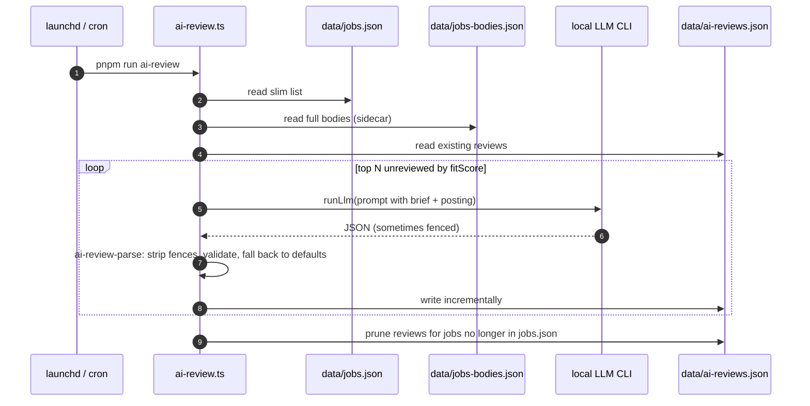

# AI Pipeline

How `job-hunt` integrates LLMs **without API keys**. Every AI feature shells out to a local LLM CLI (`claude`, `codex`, `gemini`, or `opencode`) you've already authenticated. There are no project tokens, no per-call billing inside this repo, and no hosted prompts — the same machine that drafted this README ran the daily AI review.

This is the part of the project that's worth a closer look if you're evaluating engineering choices around AI tooling. The rest of the pipeline lives in [`architecture.md`](./architecture.md).

## Why local CLIs instead of an SDK

The conventional path — install `@anthropic-ai/sdk` or `openai`, plumb an API key through env vars, pay per-token — has three downsides for a personal aggregator:

1. **Cost surface area.** Per-token billing is fine at scale, but for a single user running 20 reviews/day it's friction. Subscriptions like Claude Max already cover this usage at a flat rate.
2. **Multi-provider lock-in.** Each SDK has different request shapes, streaming protocols, and auth patterns. Switching providers means rewriting the integration.
3. **Onboarding tax.** A forker would need to create an API account, generate a key, and persist it before the AI features work.

Local CLIs solve all three: the user already authenticated their `claude` / `codex` / `gemini` session, the CLI handles request shape and retries, and switching providers is `JOB_HUNT_LLM=codex pnpm run ai-review`. The trade-off — you can't run AI features in CI, since the CI runner isn't authenticated as your local CLI user — is acceptable because every AI feature in this repo is meant to be **local-only**.

## The LLM CLI abstraction

`src/lib/llm.ts` is a 100-line shim over four CLIs:

```ts
type LlmProvider = 'claude' | 'codex' | 'gemini' | 'opencode';

export async function detectLlmCli(): Promise<LlmProvider | null> {
  // Walks PATH in priority order, returns first hit.
}

export async function runLlm(
  prompt: string,
  opts: { provider?: LlmProvider | 'auto'; timeoutMs?: number; cwd?: string }
): Promise<string> {
  // Shells out via execFile, captures stdout, throws on non-zero exit.
}
```

Provider precedence is `claude → codex → gemini → opencode` (whichever is on PATH first when `provider: 'auto'`). Override with `JOB_HUNT_LLM=<provider>` or the `provider` option. Every CLI is invoked in non-interactive "headless" mode (`claude -p`, `codex exec`, `gemini --prompt`, `opencode run`) so the process exits cleanly with the response on stdout.

Three different surfaces in this repo all consume `runLlm`:

1. `pnpm run setup-brief` — CV text → candidate brief.
2. `pnpm run ai-review` — job posting → structured review (`AiReview` shape).
3. `pnpm run ai-apply` (per-job, on-demand from the UI) — brief + posting + CV → application package.

## AI per-job review



`src/ai-review.ts` selects the top 20 unreviewed jobs by `fitScore`, builds a prompt that embeds the candidate brief verbatim plus the job posting, and asks for a structured response:

```ts
interface AiReview {
  summary: string;                // one sentence
  wants: string[];                // 3 bullets — what the role wants
  offers: string[];               // 3 bullets — what the role offers
  redFlags: string[];             // 3 bullets — concerns
  verdict: 'strong-match' | 'match' | 'weak-match' | 'skip';
  reason: string;                 // one sentence justifying the verdict
}
```

The script writes after **every** successful review, so a Ctrl-C or rate-limit kill leaves a partial-but-valid file. Reviews for jobs no longer in `data/jobs.json` are pruned automatically each run.

### Parser tolerance

LLMs occasionally wrap their JSON in markdown fences despite explicit instructions ("just JSON, no fences, no preamble"). Rather than throw, `src/ai-review-parse.ts`:

1. Strips fence markers if present.
2. Attempts `JSON.parse`.
3. Validates each field, replacing invalid values with safe defaults (empty string for `summary` / `reason`, empty array for the bullet lists, `'skip'` for an invalid verdict).
4. Returns a partial-but-valid `AiReview` — never throws.

This is tested in `tests/ai-review-parse.test.ts` with fenced JSON, invalid verdicts, missing fields, and dirty arrays. Tolerance over strictness because a partial review is still more useful than nothing.

### CLI flags

```bash
pnpm run ai-review                 # default: top 20 unreviewed by fitScore
pnpm run ai-review --top=50        # raise the per-run cap
pnpm run ai-review --force         # re-review entries that already exist
pnpm run ai-review --ids=abc,def   # specific job ids only
```

### How the UI surfaces it

In `pnpm run ui`, every job row is clickable. The expanded panel has three columns:

1. **AI take** — the review's summary, verdict reason, and three short lists (wants / offers / red flags). When no review exists yet, a "run `pnpm run ai-review`" hint replaces it.
2. **Score breakdown** — the rule-based `_signals` showing exactly which scoring rules fired (`+20 web3Stack`, `+10 stackPrimary`, etc.) so you can spot when the score is inflated by buzzwords.
3. **Meta** — location, tags, posted date, internal id (handy for `--ids=` re-review).

A small verdict badge (`strong-match` / `match` / `weak-match` / `skip`) also appears next to the title in the main row when a review exists, so you can scan from the table without expanding.

## AI Apply (on-demand)

```mermaid
sequenceDiagram
  autonumber
  participant User as User (UI)
  participant API as /api/ai-apply
  participant CLI as local LLM CLI
  participant Brief as candidate-brief.md
  participant CV as config/cv.*
  participant Pkg as data/applications/&lt;jobId&gt;.md
  participant Applied as config/applied.json

  User->>API: POST { jobId }
  API->>Brief: read brief
  API->>CV: re-attach raw CV
  API->>API: load job from jobs.json + body from jobs-bodies.json
  API->>CLI: runLlm(prompt with brief + posting + CV)
  CLI-->>API: tailored application package
  API->>Pkg: write
  API->>Applied: mark job as applied with note
  API-->>User: package URL
```

Every row in the local UI has two action buttons:

- **Apply ↗** — opens the job's posting URL in a new tab.
- **AI Apply ✨** — generates a tailored application package from your candidate brief, the job posting, and your CV (the same `config/cv.{pdf,docx,md,txt}` from onboarding). The output lands in `data/applications/<jobId>.md` and renders inline in the row's expanded detail panel with copy-to-clipboard buttons per section.

The package contains:

- **Cover letter** — 3–4 paragraphs, first-person, naturally referencing 2–3 specifics from your CV that match the role.
- **Highlights** — 4–6 bullet talking points for "why are you a good fit?" form fields.
- **Common-question answers** — short copy-pasteable replies for "why this company / why this role / start date / salary expectations".
- **Apply checklist** — what to attach + which form fields will need a custom answer beyond the above.

Clicking AI Apply ✨ also auto-marks the job as applied in `config/applied.json` with a note pointing at the application file.

The headless LLM CLIs can't drive a browser, so v1 stops at "generate the package, you copy/paste". Browser-driven autosubmit (Playwright + LLM-driven form-field discovery) is captured as Phase 2 and `// TODO: Phase 2` comments are scattered around `/api/ai-apply` and the UI button so future-you knows where to plug in.

## Setup-brief: CV → candidate brief

`pnpm run setup-brief --file ~/cv.pdf` is the bootstrap flow that generates `config/candidate-brief.md` from a CV. The CV is parsed via `src/lib/cv-parser.ts` (`pdfjs-dist` for PDF, `mammoth` for DOCX, raw text for MD/TXT, stdin support for piping), the text is truncated to 12000 chars (override via `JOB_HUNT_CV_MAX_CHARS`) to stay well under context limits, and the brief is generated by `runLlm` with a fixed prompt that asks for: who-you-are, target-stack, role-level, location preferences, and a "what to avoid" section.

The "what to avoid" section is load-bearing — it's what lets the AI review call out matches that look right on paper but aren't (e.g. a frontend brief avoids backend / SRE / data engineer titles, which the profile generator turns into a hard-drop regex). The CV file is saved to `config/cv.{pdf,docx,md,txt}` so AI Apply can re-attach it later — without re-uploading.

## Privacy: what's gitignored and why

The project is local-first and the AI flow generates personal data. These files are **gitignored** so a public fork can't leak them:

| File | What it is |
|---|---|
| `config/candidate-brief.md` | LLM-generated CV summary |
| `config/cv.{pdf,docx,md,txt}` | Original CV file (kept on disk for AI Apply) |
| `config/applied.json` | Application history |
| `config/preferences.json` | Chosen LLM CLI + onboarding-complete stamp |
| `data/jobs.json` | Daily aggregator output, tuned to your profile |
| `data/ai-reviews.json` | Per-job LLM verdicts |
| `data/jobs-bodies.json` | Full-body sidecar for AI review (transient, regenerated daily) |
| `data/applications/<job-id>.md` | AI-generated application packages |
| `data/feed.xml` | RSS feed of new matches |
| `data/archive/<YYYY-MM>.json` | Monthly snapshots |
| `JOBS.md` | Daily readable matches table |

Nothing is pushed anywhere. If you want git history of any of these (e.g. you're using a private fork as a personal sync mechanism), remove the relevant line from `.gitignore` and `git add` the file.

## Why this matters

The differentiator isn't "we added AI features". The differentiator is **how** they're integrated:

- **Same interface, four backends.** `src/lib/llm.ts` is the only file that touches the CLI shell-out. Switching providers is one env var. New providers slot in by adding a case to the dispatch switch.
- **Parser tolerance over strict prompting.** The LLM JSON parser falls back to defaults rather than throwing, because a partial review is more useful than zero.
- **Side-on, not in-the-loop.** AI is bolted onto a deterministic rule-based pipeline, not driving it. The rule-based `fitScore` ranks every job; AI then adds a second-opinion verdict on the top slice. If AI is unavailable, the rest of the pipeline still produces a useful daily digest.
- **No project API keys.** The repo runs end-to-end on your existing CLI subscription. A forker who doesn't have one installs nothing extra — they just run `scripts/install-launchd.sh --no-review`.
