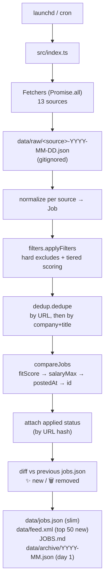

# Architecture

Deep technical reference for the daily pipeline: how raw listings become a ranked, deduped, scored, and rendered table. For high-level "what is this" framing see [`README.md`](../README.md); for AI-pipeline specifics see [`ai-pipeline.md`](./ai-pipeline.md).

## Pipeline overview



Each fetcher is isolated: it catches its own errors and returns `{ items: [], errors: [...] }` on failure. A 30s `AbortController` timeout caps every HTTP call. One source going down can't break the rest of the run.

## 1. Fetch

Each module in `src/fetchers/` exports `fetch<Source>(): Promise<{ items: Raw[]; errors: string[] }>`. Errors are caught internally and aggregated, never thrown. Per-slug isolation in the three ATS fetchers (Ashby / Greenhouse / Lever) means 404s on individual companies don't cascade. `fetchWithTimeout` retries once with a 2s backoff on `>=500` and network errors; 4xx errors are not retried. Tier-S slug arrays for the ATS fetchers are loaded from `config/slugs.json` — adding a company is a non-code change.

## 2. Normalize

One function per source maps `Raw → Job`:

```ts
interface Job {
  id: string;                 // sha1 of normalized URL
  source: Source;             // Ashby | Greenhouse | Lever | ...
  title: string;
  company: string | null;
  url: string;                // http or https only — non-http schemes are rejected
  location: string | null;
  remote: boolean;
  body: string;               // HTML stripped via regex (in-memory only)
  tags: string[];
  salary: string | null;
  salaryMin: number | null;       // parsed annual integer (USD/EUR/...)
  salaryMax: number | null;
  salaryCurrency: string | null;  // ISO code: 'USD' | 'EUR' | 'GBP' | ...
  postedAt: string | null;    // ISO 8601
  fetchedAt: string;
  fitScore: number;           // 0-100, populated by filters
  category: 'web3' | 'ai' | 'web3+ai' | 'general';
  _signals?: JobSignals;      // per-job scoring breakdown
  applied?: AppliedEntry;
}
```

URLs are canonicalized (`utm_*` stripped, trailing slash normalized) before hashing into `id`. Non-`http(s):` URLs are rejected as defense against `javascript:` / `data:` / `file:` payloads. The `body` field is stripped from the persisted `data/jobs.json` (it bloats the artifact ~10×) — `body` is only present in-memory during a run, with a separate gitignored `data/jobs-bodies.json` sidecar for the AI review step.

## 3. Filter + score

### Hard excludes (drop entirely)

The hard-drop chain is a named-rule list (`HARD_RULES` in `src/filters.ts`) — every drop is attributed to a rule name, and the per-rule count is surfaced in JOBS.md (`(missing_senior_req=812, title_non_eng_role=64, ...)`) so you can see at a glance which rule is doing the heavy lifting. To add a new hard-drop check, append a `{ name, test }` entry to `HARD_RULES`.

- URL is not http/https (security gate via `isSafeUrl`).
- Title contains `junior|jr|intern|entry-level|associate|graduate|trainee|apprentice`.
- Title does **not** contain a senior_req keyword (`senior|sr|staff|principal|lead|head|director|engineer(s)|developer(s)|architect(s)`).
- Body matches a hard US-only / onsite pattern (uses the **full** body, not the truncated scoring body — onsite language at the bottom of a posting must still count).
- Title or body matches a non-engineering pattern AND title lacks an engineering keyword.
- Title matches `TITLE_NON_ENG_COMPOUND`: customer support/success engineer, sales engineer, solutions engineer, developer relations/advocate/experience, devrel, field engineering/operations, business/sales/people operations, partner(ships) engineer, technical sourcer/recruiter, forward-deployed/implementation/onboarding engineer, gtm, go-to-market.
- Title matches `TITLE_NON_ENG_LEADERSHIP`: VP/Vice President, CMO, CRO, CFO, COO.
- Title matches `TITLE_NON_FRONTEND_ENG`: product security / data / devops / sre / infrastructure / platform / qa / network / firmware / embedded engineer.
- Title matches `TITLE_NON_ENG_ROLE`: lead/manager roles for client/account/customer/business/product/operations/regional/country. (Real "engineering lead" roles still pass via the seniorReq engineering keyword.)
- Title matches `TITLE_NON_TECH_ROLE`: analyst, trader, scientist, researcher.

### Body preparation for scoring

Before regex-matching for keywords, the body is run through `preparedScoringBody`: it strips known company-boilerplate sections (EEO, privacy notices, accommodations, "About us") and truncates to the first 1500 characters. This prevents false positives from recruiter footers (e.g. "we use Anthropic Claude internally for support tooling" landing a +20 AI signal on a backend role). Hard-drop checks still see the full body.

### Soft signals

Additive, capped at 100; weights live in `config/profile.json`:

| Signal | Weight |
|---|---:|
| Web3 — title or body contains `web3\|crypto\|defi\|blockchain\|wallet\|onchain\|dapp\|nft` | +20 |
| Web3 stack — body contains `wagmi\|viem\|ethers\|web3.js\|solana\|anchor\|evm\|rainbowkit\|walletconnect\|reown\|hardhat\|foundry` | +20 |
| AI — title or body contains `ai engineer\|ml engineer\|llm\|gen-ai\|generative ai\|ai-native` | +20 |
| AI stack — body contains `anthropic\|claude\|openai\|gpt\|vercel ai\|ai sdk\|langchain\|llamaindex\|rag\|agents\|mcp\|prompt engineering` | +20 |
| Stack — body contains `react\|next.js\|typescript` (tiered) | +10 base |
| Stack — body contains `react native\|expo` (tiered) | +5 base |
| Stack — body contains `graphql\|tailwind\|vite` (tiered) | +5 base |
| Lead title — title contains `lead\|staff\|principal\|head` | +15 |
| Senior title — title contains `senior\|sr` | +10 |
| Frontend title — title contains `frontend\|front-end\|fullstack\|full-stack\|web\|mobile` | +10 |
| Frontend body — body contains role-specific frontend phrases (design system, ship components, accessibility) (tiered) | +10 base |
| Location — location or body contains `remote\|worldwide\|emea\|europe\|cet\|spain\|global\|anywhere` | +10 |
| Freshness — `postedAt` within 7 days | +10 |
| Freshness — `postedAt` within 14 days (and not within 7) | +5 |
| **Penalty** — body US-centric without remote-worldwide language | **-10** |

**Tiered keyword weighting.** The four "stack/frontend body" signals (rows marked _tiered_) count occurrences instead of binary-matching: 1 mention = half-weight, 2–3 = listed base weight, 4+ = 1.5× boost. Implemented with global-flag regexes + `countMatches` in `tieredWeight(count, baseWeight)`. The other signals stay binary because they're inherently low-cardinality and gaming them with repetition isn't a real concern.

**Drop** anything with `fitScore < minScoreToKeep` (default 30) after the cap.

**Category** is derived from which signals fired: both web3 and AI → `web3+ai`; only web3 → `web3`; only AI → `ai`; neither → `general`.

**Adding a new positive signal.** Append the field to the `JobSignals` interface in `types.ts`, add its weight to `config/profile.json#weights`, and append one line to the `positives` object literal in `applyFilters`. The sum is computed via `Object.values(positives).reduce(...)` so any new field is auto-included.

### Debugging fitScore via `_signals`

Every kept job in `data/jobs.json` has a `_signals` object showing exactly which scoring rules fired:

```jsonc
"_signals": {
  "web3TitleBody": 0,    "web3Stack": 20,
  "aiTitleBody": 20,     "aiStack": 20,
  "stackPrimary": 10,    "stackRn": 0,    "stackOther": 0,
  "leadTitle": 0,        "seniorTitle": 10,
  "frontendTitle": 10,   "frontendBody": 10,
  "locationRemote": 10,
  "freshness7d": 10,     "freshness14d": 0,
  "usCentricPenalty": 0,
  "rawTotal": 110,       "capped": true
}
```

When tuning regexes, run `pnpm run dev`, then `jq '.[0]._signals' data/jobs.json` to see the breakdown of the top job. `rawTotal` is the un-capped positive sum; `capped: true` means positives summed > 100 before clamping.

## 4. Dedup

Two passes in `src/dedup.ts`:

1. By `id` (URL hash).
2. By `sha1(normalize(company) + '|' + normalize(title))`.

When two jobs collide, the higher `fitScore` wins. Ties are broken by `SOURCE_PRIORITY`:

```
aave = ashby-private > ashby > lever > greenhouse > cryptojobslist
  > web3career > aijobsnet > hn-hiring > hn-jobs
  > remotive > weworkremotely > remoteok
```

## 5. Final sort (`compareJobs`)

After dedup, the orchestrator sorts via the exported `compareJobs` comparator:

1. `fitScore` desc — primary.
2. `salaryMax` desc — transparent-comp companies float up among score-tied roles (`null` is treated as 0).
3. `postedAt` desc — newest first.
4. `id` asc — deterministic tiebreak so day-over-day diffs stay stable when everything else ties.

The comparator is exported (not just inlined) so it can be unit-tested directly in `tests/dedup.test.ts`.

## 6. Diff against previous run

Before writing the new `data/jobs.json`, the orchestrator reads the **previous** committed copy, builds two sets, and computes:

- `newJobs = current − previous` → "✨ New since last run" section (top 20 by fitScore, also drives `data/feed.xml`).
- `removedJobs = previous − current` → "🗑 Removed since last run" section (top 10 by previous fitScore).

On the very first run (no previous file) both diffs are empty (sections omitted). This prevents the first run from declaring "all 900 jobs are new" when there's no baseline.

## 7. Render

`src/render.ts` produces `JOBS.md`:

1. 🚨 Source-health banner (only when one or more fetchers returned zero items or had errors).
2. Stats (totals, drop reasons with per-rule breakdown, by-source breakdown with 🚨 prefixes for unhealthy sources, by-category breakdown).
3. 📋 Application status — summary line + table of every job in `config/applied.json`, sorted by date desc (omitted when no entries).
4. ✨ New since last run — top 20 by fitScore (omitted on first run / when empty).
5. 🗑 Removed since last run — top 10 by previous fitScore (omitted on first run / when empty).
6. Top Web3 + AI — top 10.
7. Top Web3 — top 20.
8. Top AI — top 20.
9. Other — top 10.

Each row: `Score | Title | Company | Source | Posted (relative) | Link`. The title cell carries an emoji prefix when the job is in `config/applied.json` (📝 applied, 💬 interview, 🎯 offer, ❌ rejected, ⏸ withdrawn) and a ` · <salary>` suffix when the source provides salary data.

## RSS feed

`src/feed.ts` emits a hand-rolled RSS 2.0 XML to `data/feed.xml` containing the top 50 `newJobs` by fitScore. The XML is hand-built (not via fast-xml-parser) because we control the content shape — `escapeXml` covers the five entity classes. Feed metadata is overridable via `JOB_HUNT_FEED_TITLE` / `JOB_HUNT_FEED_DESC` / `JOB_HUNT_FEED_LINK`. To subscribe, point your RSS reader at the `file://` path.

## Salary parsing

`src/salary.ts` `parseSalary(raw)` returns `{ min, max, currency }`, normalizing to **annual integers** (USD/EUR/etc., minor units stripped). Handles `$120K-$180K`, `€80,000 - €110,000`, `100K-150K USD`, hourly via 2080-hour annualization, M-suffixed (`$1M-$2M`), single-value salaries, currency code or symbol detection, and rejects sub-$1000 amounts as noise. Returns `{ null, null, null }` for free-text like "competitive". Hooked into `normalize.ts` via a `withSalary()` spread so adding a future salary-emitting source is one line.

## Source-health alarms

`src/render.ts` flags fetchers whose `fetched === 0` OR `errors > 0` in the **current run**: a 🚨 banner appears above the Stats section, and the offending sources get a 🚨 prefix in the by-source list. Single-run signal only — no historical tracking. Catches silent breakage (web3career and aijobsnet markup changes have hit us before).

## Application tracking

`config/applied.json` is the source of truth for jobs you've applied to. Schema:

```ts
type ApplicationStatus = 'applied' | 'interview' | 'offer' | 'rejected' | 'withdrawn';
interface AppliedEntry { url: string; status: ApplicationStatus; date: string; notes?: string }
```

`src/applied.ts` loads the file at run-time, hashes each `url` with the same `sha1(normalizeUrl(...))` used for `Job.id`, and attaches the matching entry as `Job.applied`. Matched jobs are surfaced in the "📋 Application status" section at the top of `JOBS.md` **and** keep appearing in their normal category section with the status emoji prefix — a deliberate choice so already-applied jobs aren't filtered out (you may want to follow up or compare against a new posting).

UI edits go through a Vite middleware (`appliedApiPlugin` in `ui/vite.config.ts`) exposing `GET / POST / DELETE /api/applied`, which reads/writes the same file. The UI uses optimistic updates (a failure rolls back and shows a banner). No auto-commit — the project is local-first; commit `config/applied.json` manually to sync across machines.

## GitHub Actions

One workflow: `.github/workflows/check.yml`. PR-gating only — runs Biome lint, typecheck across 3 tsconfigs, Vitest, `tsc` build, Vite UI build, and `pnpm audit`. Permissions: `contents: read`. All third-party actions are pinned by full 40-char commit SHA, not floating `@v4` / `@v5` tags. Dependabot opens weekly grouped PRs to bump them.

Previously included `jobs.yml` (daily cron) and `keepalive.yml` workflows were removed when the project moved to local-first scheduling — see [`README.md`](../README.md) for the launchd/cron setup.

## Tests

Vitest, with cases across `tests/*.test.ts`. Run via `pnpm test` (CI) or `pnpm run test:watch` (interactive). The frozen `tests/fixtures/test-profile.json` keeps scoring assertions stable even when `config/profile.json` is genericized for forkers.

When tuning a filter regex or scoring weight (in `config/profile.json` or `filters.ts`), update the matching test in the same commit. The `check.yml` workflow runs the full suite on every PR.

`tsconfig.test.json` extends `tsconfig.json` with `rootDir: "."` so tests typecheck without leaking into the production build's `rootDir`.

## Known upstream fragilities

- **`cryptojobslist.com`** is fully Cloudflare-challenged for HTML and the `api.cryptojobslist.com/jobs.rss` endpoint currently returns an empty channel. The fetcher gracefully returns `[]` and picks up jobs again if upstream restores the feed.
- **`web3.career`** and **`aijobs.net`** removed RSS — both are scraped from HTML via small inline regex parsers, which means a markup change upstream will silently degrade them. If a fetcher returns `0` for several days, eyeball the raw HTML for new selectors.
- **`aijobs.net`** is dominated by spam-aggregator listings (one posting cloned to 50 cities). The fetcher dedups by base ID (`-idNNNNN-` slug pattern), which often collapses an entire page down to 2–5 distinct postings — the low kept count is intentional.
- **`hn-jobs`** routinely keeps 0–2 entries because YC company posts rarely match the senior+stack signal threshold; this is filtering working as intended.
- **`chainlink-labs`** uses Ashby with the public posting-API disabled. The `ashby-private` fetcher scrapes the same private GraphQL endpoint the embedded job board uses at runtime. A 100-candidate sweep across web3 / AI / dev-tools tier-S companies turned up no other orgs using this pattern — `chainlink-labs` appears unique, but the fetcher is config-driven so adding a future hit is a single-line edit to `config/slugs.json#ashbyPrivate`.
